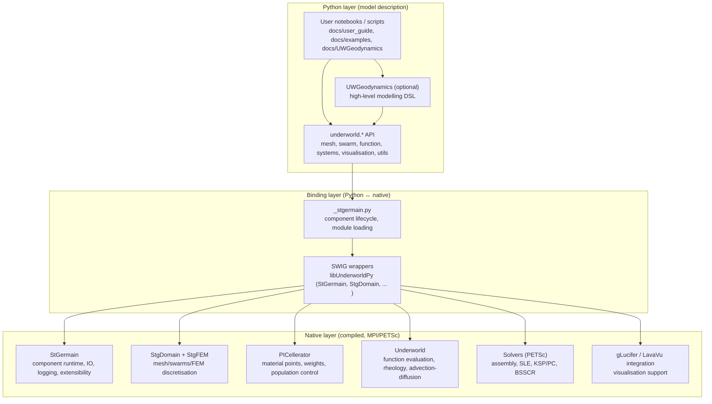
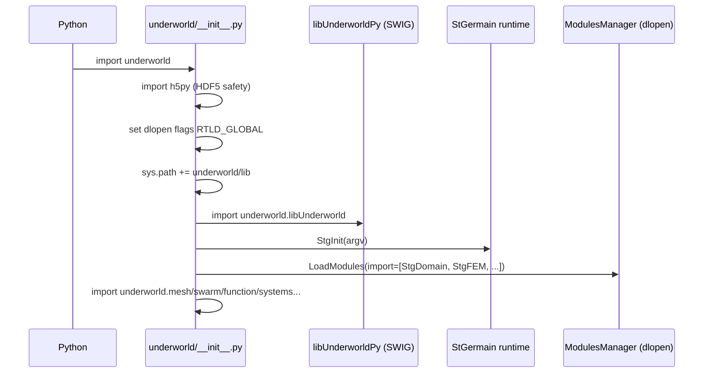
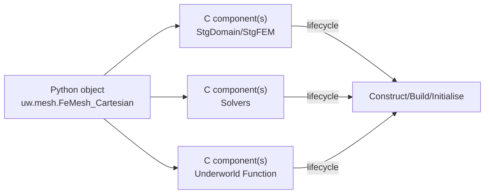
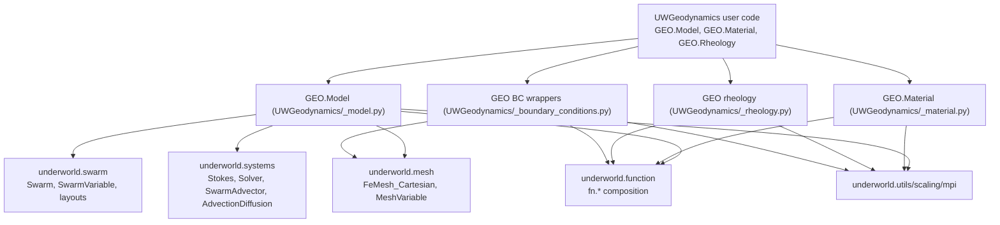
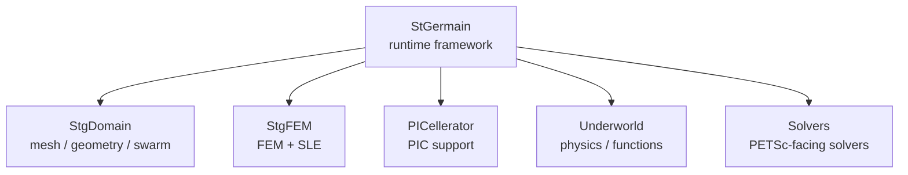
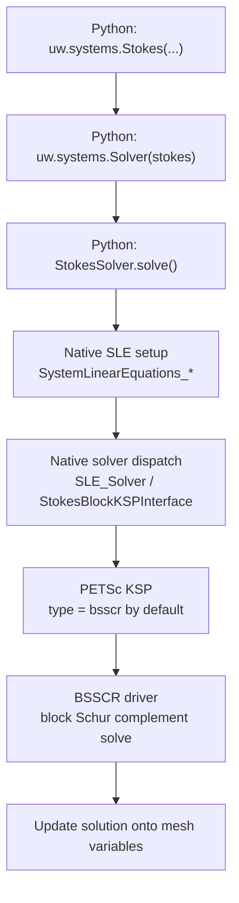
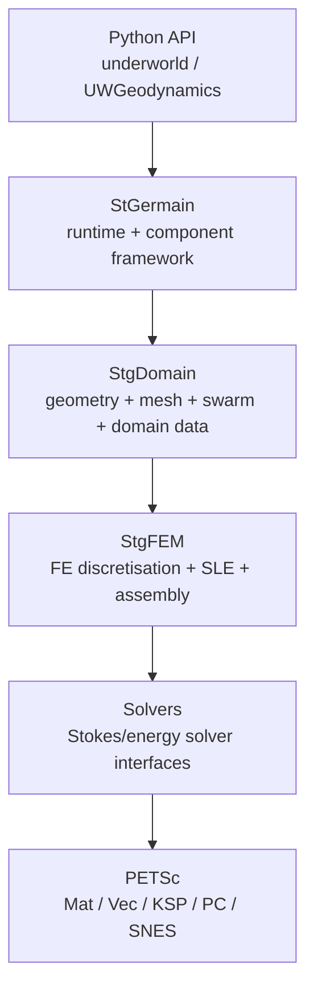
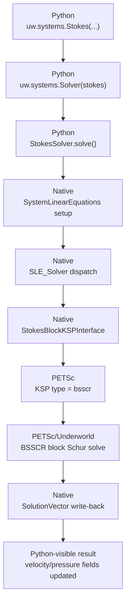
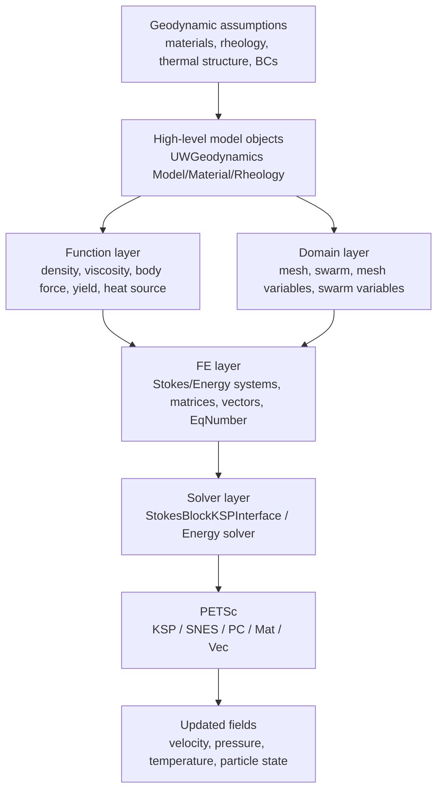
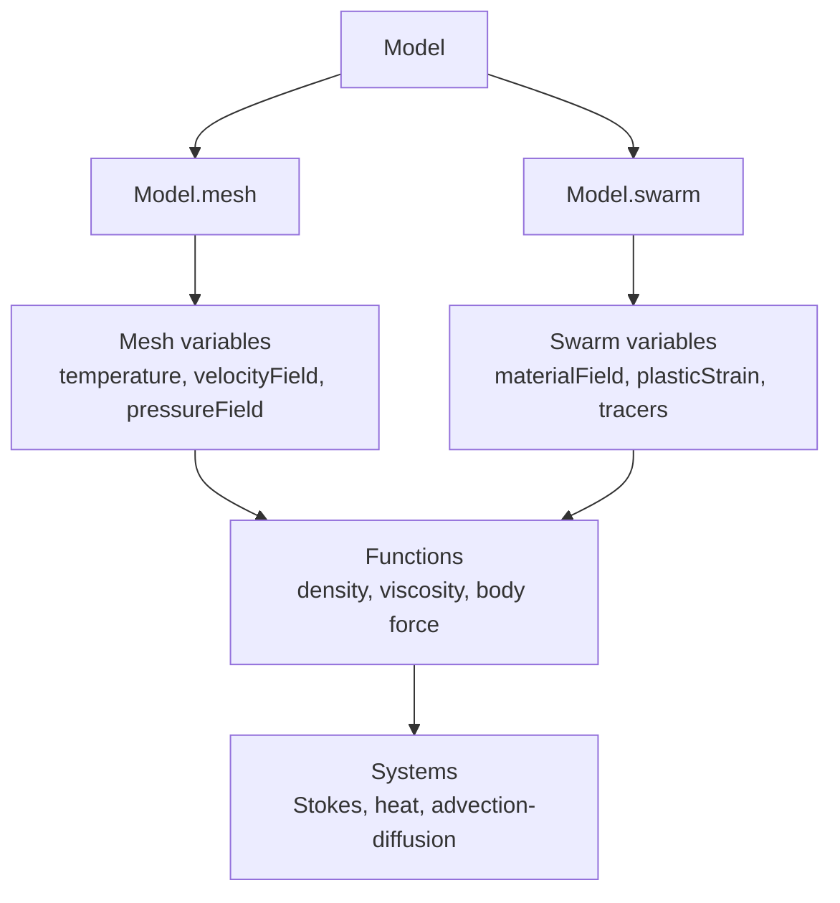

# Underworld2 Codebase Guide (for non-specialists)

This document explains how the Underworld2 codebase is organised and how its main capabilities are implemented, from a “conceptual model” down to the native (compiled) layer. It is written for readers who can read Python but are new to numerical geodynamics and HPC software architecture.

## 0. How to use this guide

This guide is intentionally layered, so you do **not** need to read it strictly from top to bottom on your first pass.

> Reading note:
> - If you are completely new to Underworld2, start with **Section 10**, then jump to **Section 22** and **Section 23** before diving into the native-core chapters.
> - If you mainly want architecture and source-code understanding, read from **Section 3** onward.
> - If you are reading this in a Markdown preview, a zoom level around **110%–125%** and a comfortable page width usually makes long technical sections much easier to read.

This document cannot enforce font family or font size across all Markdown renderers, so readability is improved here through:

- shorter sections,
- clearer transitions,
- beginner-first signposts,
- and repeated “memory aid” summaries only where they add value.

## 1. What Underworld2 is (in one page)

Underworld2 is a Python-first modelling environment for geodynamics. The typical modelling workflow is:

- Define a domain (mesh) and unknown fields (velocity/pressure/temperature, etc.).
- Define material distribution using particle swarms (PIC: particle-in-cell).
- Define constitutive laws and coefficients as composable functions.
- Assemble and solve PDE systems (especially Stokes flow) using PETSc.
- Evolve the model in time (advection, diffusion, mesh deformation, free surface, etc.).
- Analyse and visualise results in-notebook or in batch.

The key design choice is:

- Python is used to *describe* models and workflows.
- Heavy computation is executed in a statically typed compiled layer (C/C++) and parallelised with MPI (and PETSc).

This “two-layer” structure is already stated in the package docstring in [__init__.py](file:///Users/haibinyang/underworld2-2.17.x/src/underworld/__init__.py#L9-L44).

## 2. Repository map (what lives where)

At a high level:

- Source code: `/src`
- Documentation + executable notebooks: `/docs`

Inside `/src`, the important “human-facing” entry point is the Python package `underworld`:

```
src/
  underworld/                 # Python API (the thing you import)
    __init__.py               # runtime bootstrap + module loading
    _stgermain.py             # Python-side component/lifecycle glue
    function/                 # Function system (core abstraction)
    mesh/ swarm/ systems/ ... # modelling “building blocks”
    UWGeodynamics/            # higher-level modelling DSL / convenience layer
    libUnderworld/            # compiled core libraries + SWIG wrappers
```

Inside `/docs`, Underworld2 gives you two “paths”:

- **Core Underworld user guide**: `/docs/user_guide/*.ipynb`
- **UWGeodynamics tutorials/examples/benchmarks**: `/docs/UWGeodynamics/**/*`

If you want a structured learning path, see Section 10. If you want the gentlest beginner entry, also see Sections 22 and 23.

## 3. Architecture overview (layers and responsibilities)

Underworld2 is best understood as layered architecture:



Reading tip:

- If you are a *Python user*, you spend most time in `underworld/*`.
- If you are a *developer*, you also need to understand how `_stgermain.py` interacts with `libUnderworld/*` and PETSc.

## 4. Runtime bootstrap: what happens when you `import underworld as uw`

The bootstrap logic is the “spine” of the whole system, implemented in [underworld/__init__.py](file:///Users/haibinyang/underworld2-2.17.x/src/underworld/__init__.py#L49-L168).

The steps (simplified) are:

1. Import `h5py` early to avoid HDF5 ABI mismatches (PETSc vs Python wheels).
2. Change Python `dlopen` flags to `RTLD_GLOBAL` so later MPI plugins can resolve symbols.
3. Add `underworld/lib` to `sys.path` so Python can find the compiled `.so/.dylib` wrappers.
4. Import SWIG wrapper package: `underworld.libUnderworld`.
5. Initialise the StGermain runtime: `StGermain_Tools.StgInit(argv)`.
6. Dynamically load module toolboxes through `_stgermain.LoadModules(...)`.
7. Import the Python subpackages (mesh/swarm/function/systems/...) and attach timing instrumentation.



The dynamic module loading itself is implemented in [_stgermain.LoadModules](file:///Users/haibinyang/underworld2-2.17.x/src/underworld/_stgermain.py#L330-L346) and on the C side in [ModulesManager.c](file:///Users/haibinyang/underworld2-2.17.x/src/underworld/libUnderworld/StGermain/Base/Extensibility/src/ModulesManager.c#L161-L217).

## 5. The “component system” idea (StGermain + `_stgermain.py`)

One of the most important design ideas in Underworld2 is that many native objects are created and wired together as *components*.

On the native side, StGermain provides:

- a base “class/object system” for C structures,
- lifecycle phases (construct/build/initialise),
- a dictionary/configuration mechanism (commonly XML-driven),
- a plugin/module toolbox mechanism.

On the Python side, `_stgermain.py` provides wrappers which:

- keep C objects alive safely (locking/unlocking),
- automatically run lifecycle phases after Python object construction,
- make it possible to build low-level objects from Python dictionaries.

Key Python classes:

- [StgClass](file:///Users/haibinyang/underworld2-2.17.x/src/underworld/_stgermain.py#L50-L98): wraps a C pointer and manages deletion safely.
- [StgCompoundComponent](file:///Users/haibinyang/underworld2-2.17.x/src/underworld/_stgermain.py#L132-L220): creates multiple underlying StGermain components and presents them as one Python object.

Conceptually:



This is why many Underworld2 objects feel “high-level” in Python but still execute with HPC performance.

## 6. Core Python modules: what you can build with

The Python API is organised around a few foundational “building blocks”. You can treat these as the main vocabulary of the system.

### 6.1 `underworld.function`: the central abstraction

The Function system is described in [function/_function.py](file:///Users/haibinyang/underworld2-2.17.x/src/underworld/function/_function.py#L69-L82) as the central design point:

- You express coefficient fields (e.g., viscosity, density, body force, source terms) as *composable functions* in Python.
- Evaluation and heavy operations occur in C for performance.
- Functions can be continuous (analytic) or depend on discrete data (mesh variables, swarm variables).

This enables a natural modelling style:

- piecewise laws,
- temperature/pressure-dependent rheology,
- conditional behaviour (plasticity yielding),
- mixing of continuous fields and particle-tracked history.

### 6.2 `underworld.mesh`: finite element mesh + field variables

Mesh objects define:

- domain geometry and discretisation,
- mesh variables (fields defined at nodes/elements),
- special sets (boundaries, regions).

The user guide chapter [02_TheMesh.ipynb](file:///Users/haibinyang/underworld2-2.17.x/docs/user_guide/02_TheMesh.ipynb) is the best starting point.

### 6.3 `underworld.swarm`: material points (PIC) + swarm variables

Swarms are sets of particles (material points) that carry:

- material identity (which “rock” is where),
- history-dependent variables (plastic strain, melt fraction, etc.),
- integration points for PIC/FEM coupling.

This is central to Underworld’s “hybrid” approach described in [__init__.py](file:///Users/haibinyang/underworld2-2.17.x/src/underworld/__init__.py#L19-L27): accurate Stokes solutions on the mesh, and accurate material advection on particles.

Start here:

- [03_Swarms.ipynb](file:///Users/haibinyang/underworld2-2.17.x/docs/user_guide/03_Swarms.ipynb)

### 6.4 `underworld.systems`: PDE systems + solvers

The `systems` module packages the “things you solve”, such as:

- Stokes flow: `Stokes`
- Advection–diffusion: `AdvectionDiffusion`
- Steady state heat: `SteadyStateHeat`
- Steady state Darcy flow: `SteadyStateDarcyFlow`
- Time integration / swarm advection: `TimeIntegration`, `SwarmAdvector`
- Solver front-ends: `StokesSolver`, `HeatSolver`, and a generic `Solver(...)` factory

All of these are exported from [systems/__init__.py](file:///Users/haibinyang/underworld2-2.17.x/src/underworld/systems/__init__.py#L12-L22).

Recommended reading order:

- [05_Systems.ipynb](file:///Users/haibinyang/underworld2-2.17.x/docs/user_guide/05_Systems.ipynb)
- [08_StokesSolver.ipynb](file:///Users/haibinyang/underworld2-2.17.x/docs/user_guide/08_StokesSolver.ipynb)

### 6.5 `underworld.conditions`: boundary conditions and system conditions

Boundary conditions are expressed via condition objects, exported from [conditions/__init__.py](file:///Users/haibinyang/underworld2-2.17.x/src/underworld/conditions/__init__.py#L10-L15):

- `DirichletCondition`
- `NeumannCondition`
- `SystemCondition`

In practice, conditions usually reference mesh index sets (“which nodes/faces”) and functions (“what value/flux”).

### 6.6 `underworld.visualisation`: parallel data → serial rendering

Underworld’s visualisation module is explicitly designed for MPI:

- each rank produces its share of geometry/data,
- rendering is performed in serial using LavaVu (typically on rank 0),
- outputs can be raster images or database files for later rendering.

This is stated in [visualisation/__init__.py](file:///Users/haibinyang/underworld2-2.17.x/src/underworld/visualisation/__init__.py#L10-L20).

Start here:

- [07_Visualisation.ipynb](file:///Users/haibinyang/underworld2-2.17.x/docs/user_guide/07_Visualisation.ipynb)

### 6.7 `underworld.utils`, `underworld.scaling`, `underworld.mpi`: the “glue”

These modules support practical modelling:

- `utils`: integrals, I/O helpers, progress bars, checkpointing, notebook helpers.
- `scaling`: non-dimensionalisation/dimensionalisation workflow, unit support.
- `mpi`: access to communicator/rank/size and patterns for collective calls.

User guide entry point:

- [06_Utilities.ipynb](file:///Users/haibinyang/underworld2-2.17.x/docs/user_guide/06_Utilities.ipynb)

## 7. Native core libraries (what actually runs fast)

The compiled core lives in `src/underworld/libUnderworld/` and is built with CMake. The build graph is visible in [libUnderworld/CMakeLists.txt](file:///Users/haibinyang/underworld2-2.17.x/src/underworld/libUnderworld/CMakeLists.txt#L78-L207).

The important native libraries are:

- **StGermain**: the framework/runtime (component system, IO, logging, extensibility).
- **StgDomain**: mesh, geometry, swarms, shapes, domain utilities.
- **StgFEM**: FEM discretisation and provided systems (e.g., Stokes, energy).
- **PICellerator**: material points, weights, population control.
- **Underworld**: Underworld-specific function/rheology/advection-diffusion components.
- **Solvers**: PETSc-driven linear systems (assembly, SLE abstraction, KSP/PC).
- **gLucifer**: visualisation support (LavaVu integration).

### 7.1 Why there are “Toolboxmodule” shared libraries

In addition to the main libraries, you will see targets like:

- `StgDomain_Toolboxmodule`, `StgFEM_Toolboxmodule`, `PICellerator_Toolboxmodule`, ...

In CMake, these are created as shared libraries with no `lib` prefix (see the `PREFIX ""` pattern in [libUnderworld/CMakeLists.txt](file:///Users/haibinyang/underworld2-2.17.x/src/underworld/libUnderworld/CMakeLists.txt#L102-L108)).

Purpose:

- they act as dynamically-loadable modules for StGermain’s toolbox manager,
- Underworld2 loads them at runtime using `_stgermain.LoadModules(...)` during `import underworld`.

### 7.2 How Python sees the native layer (SWIG wrappers)

The SWIG wrapper package is `underworld.libUnderworld.libUnderworldPy`. Its `__init__.py` imports the extension modules:

- `StGermain`, `StgDomain`, `StgFEM`, `Solvers`, `PICellerator`, `Underworld`, `gLucifer`, ...

See [libUnderworldPy/__init__.py](file:///Users/haibinyang/underworld2-2.17.x/src/underworld/libUnderworld/libUnderworldPy/__init__.py#L1-L15).

Practical implication:

- Python objects in `underworld.*` often hold references to SWIG-wrapped C objects.
- The “heavy part” of a calculation is typically delegated to the C layer through these wrappers.

## 8. Two modelling styles: Core Underworld vs UWGeodynamics

Underworld2 gives you two ways to write models.

### 8.1 Core Underworld (“build from primitives”)

You explicitly combine:

- mesh + fields,
- swarms + swarm variables,
- functions (coefficients and laws),
- systems + solver settings,
- time stepping and output.

This style is maximally flexible and exposes numerical choices directly.

Recommended entry points:

- [docs/user_guide](file:///Users/haibinyang/underworld2-2.17.x/docs/user_guide)
- [docs/examples](file:///Users/haibinyang/underworld2-2.17.x/docs/examples)

### 8.2 UWGeodynamics (“high-level DSL for geodynamics workflows”)

`underworld.UWGeodynamics` is a higher-level modelling layer inside the same source tree. Its public entry point is [UWGeodynamics/__init__.py](file:///Users/haibinyang/underworld2-2.17.x/src/underworld/UWGeodynamics/__init__.py).

It re-exports:

- a high-level `Model`,
- common rheology/material/density/melt building blocks,
- convenient scaling shortcuts (`nd`, `dim`, `u`) so you can work in dimensional units while the solver uses non-dimensional forms.

UWGeodynamics is a good choice when you want to:

- build research-style geodynamics setups faster,
- reuse common material registries and workflows (free surface, melting, post-processing).

Recommended entry points:

- [docs/UWGeodynamics/tutorials](file:///Users/haibinyang/underworld2-2.17.x/docs/UWGeodynamics/tutorials)
- [docs/UWGeodynamics/examples](file:///Users/haibinyang/underworld2-2.17.x/docs/UWGeodynamics/examples)
- [docs/UWGeodynamics/benchmarks](file:///Users/haibinyang/underworld2-2.17.x/docs/UWGeodynamics/benchmarks)

## 9. UWGeodynamics module structure (deep dive)

This section explains how `underworld.UWGeodynamics` is structured internally and how it maps to the core `underworld.*` APIs. Think of UWGeodynamics as a “workflow layer”: it provides a high-level model object and a curated set of geodynamics building blocks that are assembled using the core Underworld primitives (mesh, swarm, function, systems).

### 9.1 Directory map

The module lives at [UWGeodynamics](file:///Users/haibinyang/underworld2-2.17.x/src/underworld/UWGeodynamics) and contains:

- Public API entrypoint: [UWGeodynamics/__init__.py](file:///Users/haibinyang/underworld2-2.17.x/src/underworld/UWGeodynamics/__init__.py)
- Core orchestration: [UWGeodynamics/_model.py](file:///Users/haibinyang/underworld2-2.17.x/src/underworld/UWGeodynamics/_model.py)
- Materials: [UWGeodynamics/_material.py](file:///Users/haibinyang/underworld2-2.17.x/src/underworld/UWGeodynamics/_material.py)
- Rheology and plasticity: [UWGeodynamics/_rheology.py](file:///Users/haibinyang/underworld2-2.17.x/src/underworld/UWGeodynamics/_rheology.py)
- Density models: [UWGeodynamics/_density.py](file:///Users/haibinyang/underworld2-2.17.x/src/underworld/UWGeodynamics/_density.py)
- Melt phase relations: [UWGeodynamics/_melt.py](file:///Users/haibinyang/underworld2-2.17.x/src/underworld/UWGeodynamics/_melt.py)
- Boundary condition wrappers: [UWGeodynamics/_boundary_conditions.py](file:///Users/haibinyang/underworld2-2.17.x/src/underworld/UWGeodynamics/_boundary_conditions.py)
- Free surface and stabilisation: [UWGeodynamics/_freesurface.py](file:///Users/haibinyang/underworld2-2.17.x/src/underworld/UWGeodynamics/_freesurface.py)
- Remeshing utilities: [UWGeodynamics/_remeshing.py](file:///Users/haibinyang/underworld2-2.17.x/src/underworld/UWGeodynamics/_remeshing.py)
- Mesh advection utilities: [UWGeodynamics/_mesh_advector.py](file:///Users/haibinyang/underworld2-2.17.x/src/underworld/UWGeodynamics/_mesh_advector.py)
- Shapes and geometry helpers: [UWGeodynamics/shapes.py](file:///Users/haibinyang/underworld2-2.17.x/src/underworld/UWGeodynamics/shapes.py)
- Surface processes integration: [UWGeodynamics/surfaceProcesses.py](file:///Users/haibinyang/underworld2-2.17.x/src/underworld/UWGeodynamics/surfaceProcesses.py)
- Postprocessing helpers: [UWGeodynamics/postprocessing](file:///Users/haibinyang/underworld2-2.17.x/src/underworld/UWGeodynamics/postprocessing)
- Reference registries (JSON): [UWGeodynamics/resources](file:///Users/haibinyang/underworld2-2.17.x/src/underworld/UWGeodynamics/resources)

### 9.2 Public API surface (what gets exported)

The top-level import pattern is:

```python
from underworld import UWGeodynamics as GEO
```

The module exports (and re-exports) most “user-facing” classes/functions directly from [UWGeodynamics/__init__.py](file:///Users/haibinyang/underworld2-2.17.x/src/underworld/UWGeodynamics/__init__.py#L6-L44), including:

- Dimensional workflow: `nd`, `dim`, `u` (Pint unit registry)
- Model entrypoint: `Model`
- Materials: `Material`, `MaterialRegistry`
- Rheology: `Rheology`, common viscous laws, plasticity criteria, registries
- Density: `ConstantDensity`, `LinearDensity`
- Melt: `Solidus`, `Liquidus`, registries
- Workflow utilities: inflow/outflow balancing, moving wall, phase changes, remesh helpers, profiling helpers

This “flat export” design is intentional: it allows tutorials to use `GEO.X` consistently without deep internal imports.

### 9.3 The `Model` class is the orchestration hub

The UWGeodynamics `Model` is implemented in [UWGeodynamics/_model.py](file:///Users/haibinyang/underworld2-2.17.x/src/underworld/UWGeodynamics/_model.py#L43-L204). It acts as a high-level container that:

- creates the mesh (`underworld.mesh.FeMesh_Cartesian`) and core fields (`MeshVariable`),
- creates and populates the material swarm (`underworld.swarm.Swarm`),
- creates convenient boundary aliases (`left_wall`, `right_wall`, `top_wall`, `bottom_wall`, ...),
- connects boundary condition objects, surface processes, isostasy, and visualisation helpers,
- later (during initialisation/solve) builds the Stokes/energy systems and solver objects from `underworld.systems`.

You can see the core construction sequence directly in the `__init__` body:

- non-dimensionalise coordinates (`nd(...)`)
- create mesh: `FeMesh_Cartesian(...)`
- create mesh variables: `pressureField`, `velocityField`, ...
- create swarm: `Swarm(mesh=self.mesh, ...)` and populate via `PerCellSpaceFillerLayout`

### 9.4 How UWGeodynamics maps to core Underworld modules

Conceptually, UWGeodynamics is “composition over re-implementation”:



Practical reading tip:

- When you want to understand “what actually gets solved”, always trace from `GEO.Model` into the core `underworld.systems` objects that it builds.

### 9.5 Materials and registries (why there are JSON files)

UWGeodynamics provides registries so users can refer to standardised rheology/material definitions by name rather than retyping parameter sets.

- Materials and defaults are implemented in [UWGeodynamics/_material.py](file:///Users/haibinyang/underworld2-2.17.x/src/underworld/UWGeodynamics/_material.py#L24-L170).
- Registries are backed by JSON files in [UWGeodynamics/resources](file:///Users/haibinyang/underworld2-2.17.x/src/underworld/UWGeodynamics/resources), such as:
  - `Materials.json`
  - `ViscousRheologies.json`
  - `PlasticRheologies.json`
  - `Solidus.json`, `Liquidus.json`

This pattern supports:

- reproducibility (named parameter sets),
- easier teaching/tutorials (less boilerplate),
- consistent defaults for common geodynamics scenarios.

### 9.6 Rheology in UWGeodynamics is still “Functions all the way down”

The rheology module builds `underworld.function` expressions for viscosity/yielding/etc.

Example: `Limiter` in [UWGeodynamics/_rheology.py](file:///Users/haibinyang/underworld2-2.17.x/src/underworld/UWGeodynamics/_rheology.py#L86-L110) is a `fn.Function` wrapper that clamps a value between bounds using `fn.misc.min/max`.

This is a recurring theme in UWGeodynamics:

- high-level objects ultimately compile down to `fn.*` graphs,
- those graphs evaluate in the compiled layer for performance.

### 9.7 Boundary condition wrappers (Model-aware BC objects)

Core Underworld boundary conditions are lower-level and generally take index sets + values/functions. UWGeodynamics provides Model-aware boundary condition objects that:

- accept wall selectors (`left/right/top/bottom/front/back`) and arbitrary node sets,
- accept materials or shapes as selectors,
- accept scalars, Pint quantities, or `fn.Function` values.

The implementation is in [UWGeodynamics/_boundary_conditions.py](file:///Users/haibinyang/underworld2-2.17.x/src/underworld/UWGeodynamics/_boundary_conditions.py#L13-L219), where `_convert_nodes_to_indexSets(...)` shows how shapes/functions are converted into `FeMesh_IndexSet` selections.

### 9.8 Free surface, remeshing, surface processes (workflow extensions)

UWGeodynamics bundles common “research workflow” extensions:

- Free surface stabilisation: [UWGeodynamics/_freesurface.py](file:///Users/haibinyang/underworld2-2.17.x/src/underworld/UWGeodynamics/_freesurface.py)
- Remeshing: [UWGeodynamics/_remeshing.py](file:///Users/haibinyang/underworld2-2.17.x/src/underworld/UWGeodynamics/_remeshing.py)
- Mesh advection helpers: [UWGeodynamics/_mesh_advector.py](file:///Users/haibinyang/underworld2-2.17.x/src/underworld/UWGeodynamics/_mesh_advector.py)
- Surface processes integration: [UWGeodynamics/surfaceProcesses.py](file:///Users/haibinyang/underworld2-2.17.x/src/underworld/UWGeodynamics/surfaceProcesses.py)

These are best understood by following the UWGeodynamics tutorials in `/docs/UWGeodynamics/tutorials/`, where the end-to-end workflow is shown in executable form.

## 10. Suggested learning path (beginner → confident → developer)

This is the main navigation section for the whole guide.

If you feel overwhelmed by the implementation chapters later on, pause and read **Section 22** and **Section 23** before continuing.

### 10.1 If you want to run models (no codebase diving yet)

1. Core concepts and environment: [01_GettingStarted.ipynb](file:///Users/haibinyang/underworld2-2.17.x/docs/user_guide/01_GettingStarted.ipynb)
2. Mesh: [02_TheMesh.ipynb](file:///Users/haibinyang/underworld2-2.17.x/docs/user_guide/02_TheMesh.ipynb)
3. Swarms: [03_Swarms.ipynb](file:///Users/haibinyang/underworld2-2.17.x/docs/user_guide/03_Swarms.ipynb)
4. Functions: [04_Functions.ipynb](file:///Users/haibinyang/underworld2-2.17.x/docs/user_guide/04_Functions.ipynb)
5. Systems: [05_Systems.ipynb](file:///Users/haibinyang/underworld2-2.17.x/docs/user_guide/05_Systems.ipynb)
6. Utilities + I/O: [06_Utilities.ipynb](file:///Users/haibinyang/underworld2-2.17.x/docs/user_guide/06_Utilities.ipynb)
7. Visualisation: [07_Visualisation.ipynb](file:///Users/haibinyang/underworld2-2.17.x/docs/user_guide/07_Visualisation.ipynb)
8. Stokes solver details: [08_StokesSolver.ipynb](file:///Users/haibinyang/underworld2-2.17.x/docs/user_guide/08_StokesSolver.ipynb)

Then choose 2–3 end-to-end examples from:

- [docs/examples](file:///Users/haibinyang/underworld2-2.17.x/docs/examples)

### 10.2 If you want to build models faster (UWGeodynamics)

After finishing the core user guide once, do:

- [Tutorial_1_ThermoMechanical_Model.ipynb](file:///Users/haibinyang/underworld2-2.17.x/docs/UWGeodynamics/tutorials/Tutorial_1_ThermoMechanical_Model.ipynb)
- then a tutorial related to your topic (subduction, free surface, coupling, etc.) from [tutorials](file:///Users/haibinyang/underworld2-2.17.x/docs/UWGeodynamics/tutorials).

### 10.3 If you want to understand how the system is implemented (developer path)

Suggested order:

1. Import/bootstrap: [underworld/__init__.py](file:///Users/haibinyang/underworld2-2.17.x/src/underworld/__init__.py#L49-L108)
2. Component lifecycle glue: [StgClass](file:///Users/haibinyang/underworld2-2.17.x/src/underworld/_stgermain.py#L50-L98) and [StgCompoundComponent](file:///Users/haibinyang/underworld2-2.17.x/src/underworld/_stgermain.py#L132-L240)
3. Function system: [Function](file:///Users/haibinyang/underworld2-2.17.x/src/underworld/function/_function.py#L69-L82)
4. Native build graph: [libUnderworld/CMakeLists.txt](file:///Users/haibinyang/underworld2-2.17.x/src/underworld/libUnderworld/CMakeLists.txt#L78-L207)
5. Dynamic module loading (native): [ModulesManager.c](file:///Users/haibinyang/underworld2-2.17.x/src/underworld/libUnderworld/StGermain/Base/Extensibility/src/ModulesManager.c#L161-L217)

## 11. A “mental model” for reading Underworld2 code

When you see a high-level Python object in Underworld2, ask these questions:

1. **What discrete objects does it own?** (mesh variables, swarm variables, solvers, etc.)
2. **Which Functions define its coefficients?** (viscosity, density, boundary values)
3. **Where does evaluation happen?** (pure Python vs SWIG-wrapped C calls)
4. **What is the lifecycle?** (created → constructed → built → initialised → used → destroyed)
5. **What is the parallel behaviour?** (per-rank data? rank 0 rendering? collective solves?)

If you follow these questions, the codebase becomes much easier to navigate.

## 12. Five key terms before the deep dive

This is a very small pre-reading glossary.

For the full beginner-friendly terminology guide, see **Section 23**.

- **FEM (finite element method)**: represents fields on a mesh and solves PDEs by assembling matrix systems.
- **PIC (particle in cell)**: represents materials/history on particles while solving flow on a mesh.
- **Stokes system**: incompressible creeping flow (velocity + pressure) common in mantle/lithosphere models.
- **PETSc**: HPC library for sparse linear algebra and solvers; Underworld uses it heavily.
- **MPI**: distributed-memory parallelism; Underworld models are usually executed with `mpirun`.

## 13. Python source tour: `underworld` (core API, excluding UWGeodynamics)

This section is a “file-by-file map” of the Python layer under `src/underworld/`. It is intended to answer:

- What does each file do?
- Which other modules does it depend on?
- Why is the code organized this way?

Design principle to keep in mind:

- High-level Python objects mostly orchestrate and validate.
- The heavy computation is delegated to SWIG-wrapped native components, with MPI/PETSc providing performance and scalability.

### 13.1 Top-level package files

| File | Role in the system | Key interactions / why it exists |
|---|---|---|
| [__init__.py](file:///Users/haibinyang/underworld2-2.17.x/src/underworld/__init__.py) | Runtime bootstrap, module loading, timing/sig fixes | Ensures correct HDF5 linkage, sets `RTLD_GLOBAL` for MPI plugin symbol resolution, initializes StGermain (`StgInit`) and loads toolboxes, then instruments submodules. This centralizes “import-time invariants” so user code is simpler. |
| [_stgermain.py](file:///Users/haibinyang/underworld2-2.17.x/src/underworld/_stgermain.py) | Python↔C lifecycle glue (component graph creation) | Provides `StgClass` and `StgCompoundComponent` to build/own native components safely (lock/unlock/delete) and run Construct/Build/Initialise automatically. This keeps native object lifecycle consistent across the API. |
| [timing.py](file:///Users/haibinyang/underworld2-2.17.x/src/underworld/timing.py) | Optional walltime instrumentation | Activated via `UW_ENABLE_TIMING` before import; wraps modules/classes to report timing without changing user code. |
| [mpi.py](file:///Users/haibinyang/underworld2-2.17.x/src/underworld/mpi.py) | Minimal MPI facade | Provides `comm/rank/size` and ordered `call_pattern` utilities used by IO and debugging. |
| [_version.py](file:///Users/haibinyang/underworld2-2.17.x/src/underworld/_version.py) | Version string | Kept separate to avoid importing heavy modules when only version is needed. |
| [_uwid.py](file:///Users/haibinyang/underworld2-2.17.x/src/underworld/_uwid.py) | Installation/run identifier | Provides a unique id used in import telemetry and diagnostics. |
| [_net/__init__.py](file:///Users/haibinyang/underworld2-2.17.x/src/underworld/_net/__init__.py) | Optional telemetry (opt-out) | Called from `underworld.__init__` on rank 0; isolated so telemetry can be disabled without affecting the numerical core. |

### 13.2 `underworld.container` (index sets and selection primitives)

| File | Role in the system | Key interactions / why it exists |
|---|---|---|
| [container/__init__.py](file:///Users/haibinyang/underworld2-2.17.x/src/underworld/container/__init__.py) | Public exports | Exposes `IndexSet`, `ObjectifiedIndexSet`. |
| [container/_indexset.py](file:///Users/haibinyang/underworld2-2.17.x/src/underworld/container/_indexset.py) | Efficient integer sets | Provides set operations and interoperability; used by meshes for `specialSets` and by `conditions` to specify constrained DOFs. |

### 13.3 `underworld.conditions` (boundary and system conditions)

| File | Role in the system | Key interactions / why it exists |
|---|---|---|
| [conditions/__init__.py](file:///Users/haibinyang/underworld2-2.17.x/src/underworld/conditions/__init__.py) | Public exports | Re-exports `DirichletCondition`, `NeumannCondition`, `SystemCondition`. |
| [conditions/_conditions.py](file:///Users/haibinyang/underworld2-2.17.x/src/underworld/conditions/_conditions.py) | Condition implementations | `DirichletCondition` registers fixed DOFs on FE variables; `NeumannCondition` provides flux/traction via `fn.Function`. Consumed by `systems` during assembly (`FeVariable_SetBC` for Dirichlet; surface assembly terms for Neumann). |

### 13.4 `underworld.function` (core “math language”)

The function system is central by design: it is the common interface for coefficients, constitutive laws, and postprocessing, while executing evaluations in the compiled layer for performance.

| File | Role in the system | Key interactions / why it exists |
|---|---|---|
| [function/__init__.py](file:///Users/haibinyang/underworld2-2.17.x/src/underworld/function/__init__.py) | Public API | Re-exports the `Function` framework and submodules as `underworld.function.*`. |
| [function/_function.py](file:///Users/haibinyang/underworld2-2.17.x/src/underworld/function/_function.py) | Core function abstraction | Defines `Function` and `FunctionInput`, evaluation (`evaluate`, `evaluate_global`), conversion (`convert`), operator overloading, and links to the C backend via `libUnderworldPy.Function`. |
| [function/math.py](file:///Users/haibinyang/underworld2-2.17.x/src/underworld/function/math.py) | Math operators | `sin/cos/exp/log/sqrt/pow/dot/...` implemented as C-backed function nodes. |
| [function/misc.py](file:///Users/haibinyang/underworld2-2.17.x/src/underworld/function/misc.py) | Constants and basic ops | `constant`, `min`, `max`; used heavily by `Function.convert()` and rheology limiters. |
| [function/branching.py](file:///Users/haibinyang/underworld2-2.17.x/src/underworld/function/branching.py) | Conditional logic | `conditional` and `map` implement “if/switch” style function graphs (C-backed). |
| [function/tensor.py](file:///Users/haibinyang/underworld2-2.17.x/src/underworld/function/tensor.py) | Tensor helpers | Strain-rate/stress-style derived quantities: symmetric, deviatoric, second invariant. |
| [function/shape.py](file:///Users/haibinyang/underworld2-2.17.x/src/underworld/function/shape.py) | Geometric predicates | `Polygon` inclusion test; used for masks (materials, BC selection) and later mapped into IndexSets. |
| [function/rheology.py](file:///Users/haibinyang/underworld2-2.17.x/src/underworld/function/rheology.py) | Rheology-specific helpers | Builds composite limiters (eg stress-limiting viscosity) using `tensor` + `branching`. |
| [function/exception.py](file:///Users/haibinyang/underworld2-2.17.x/src/underworld/function/exception.py) | Runtime guards | `SafeMaths` and `CustomException` wrap functions to fail fast on invalid values/conditions. |
| [function/view.py](file:///Users/haibinyang/underworld2-2.17.x/src/underworld/function/view.py) | Instrumentation views | `min_max` (tracks extrema, supports MPI global aggregation) and `count` (evaluation counters). |
| [function/analytic.py](file:///Users/haibinyang/underworld2-2.17.x/src/underworld/function/analytic.py) | Analytic solutions | Provides exact Stokes solutions as functions for verification and tutorials; also constructs example `DirichletCondition`s for benchmark setups. |

### 13.5 `underworld.mesh` (meshes and FE field variables)

| File | Role in the system | Key interactions / why it exists |
|---|---|---|
| [mesh/__init__.py](file:///Users/haibinyang/underworld2-2.17.x/src/underworld/mesh/__init__.py) | Public API | Exposes `FeMesh`, `FeMesh_Cartesian`, `MeshVariable`, and index set types. |
| [mesh/_mesh.py](file:///Users/haibinyang/underworld2-2.17.x/src/underworld/mesh/_mesh.py) | Mesh implementation | Implements cartesian mesh generation, mesh deformation (`deform_mesh`), connectivity views, and `FeMesh_IndexSet`. Centralizes “domain geometry” and the conversion into native components. |
| [mesh/_meshvariable.py](file:///Users/haibinyang/underworld2-2.17.x/src/underworld/mesh/_meshvariable.py) | FE field variables | `MeshVariable` with numpy views and HDF5/XDMF save/load; used as unknown fields and coefficient fields for systems. |
| [mesh/_specialSets_Cartesian.py](file:///Users/haibinyang/underworld2-2.17.x/src/underworld/mesh/_specialSets_Cartesian.py) | Boundary sets | Builds standard boundary IndexSets (Min/Max I/J/K, AllWalls) used throughout conditions, solvers, and examples. |

### 13.6 `underworld.swarm` (particles, integration swarms, population control)

| File | Role in the system | Key interactions / why it exists |
|---|---|---|
| [swarm/__init__.py](file:///Users/haibinyang/underworld2-2.17.x/src/underworld/swarm/__init__.py) | Public API | Exposes `Swarm`, integration swarms, variables, and layouts. |
| [swarm/_swarmabstract.py](file:///Users/haibinyang/underworld2-2.17.x/src/underworld/swarm/_swarmabstract.py) | Base swarm behavior | Defines common swarm lifecycle rules and safe management of numpy views under particle reallocation. |
| [swarm/_swarm.py](file:///Users/haibinyang/underworld2-2.17.x/src/underworld/swarm/_swarm.py) | Material swarm | Particle ownership/migration, add/save/load, post-mesh-deform hooks, and helper masks. |
| [swarm/_swarmvariable.py](file:///Users/haibinyang/underworld2-2.17.x/src/underworld/swarm/_swarmvariable.py) | Per-particle fields | Typed particle data, HDF5/XDMF persistence, and lifecycle safety checks. |
| [swarm/_integration_swarm.py](file:///Users/haibinyang/underworld2-2.17.x/src/underworld/swarm/_integration_swarm.py) | Quadrature point swarms | Gauss integration swarms and Voronoi integration swarms (PIC-friendly quadrature). |
| [swarm/_weights.py](file:///Users/haibinyang/underworld2-2.17.x/src/underworld/swarm/_weights.py) | Voronoi/DVC weights | DVC/PCDVC weight computations used by Voronoi integration and population control. |
| [swarm/_population_control.py](file:///Users/haibinyang/underworld2-2.17.x/src/underworld/swarm/_population_control.py) | Orchestration layer | User-facing population control management, delegates to native PICellerator helpers. |
| [swarm/layouts.py](file:///Users/haibinyang/underworld2-2.17.x/src/underworld/swarm/layouts.py) | Initialization layouts | Particle seeding layouts (Gauss, Sobol space-filler, random) used in examples and in higher-level workflows. |

### 13.7 `underworld.systems` (PDE construction and solver front-ends)

| File | Role in the system | Key interactions / why it exists |
|---|---|---|
| [systems/__init__.py](file:///Users/haibinyang/underworld2-2.17.x/src/underworld/systems/__init__.py) | Public API | Exposes PDE system builders and solver facades, including `Solver = _Solver.factory`. |
| [systems/_solver.py](file:///Users/haibinyang/underworld2-2.17.x/src/underworld/systems/_solver.py) | Solver dispatch | Chooses concrete solver class based on system type to keep user-facing API small. |
| [systems/_stokes.py](file:///Users/haibinyang/underworld2-2.17.x/src/underworld/systems/_stokes.py) | Stokes system builder | Assembles the Stokes SLE components and terms; supports different quadrature strategies. |
| [systems/_bsscr.py](file:///Users/haibinyang/underworld2-2.17.x/src/underworld/systems/_bsscr.py) | Stokes solver | PETSc-based block Schur complement solver (BSSCR) with MG and nonlinear loop options. |
| [systems/_options.py](file:///Users/haibinyang/underworld2-2.17.x/src/underworld/systems/_options.py) | PETSc options | Option containers/presets for KSP/PC configuration. |
| [systems/_thermal.py](file:///Users/haibinyang/underworld2-2.17.x/src/underworld/systems/_thermal.py) | Steady-state heat | Diffusion + sources + flux terms assembly into a linear system. |
| [systems/_energy_solver.py](file:///Users/haibinyang/underworld2-2.17.x/src/underworld/systems/_energy_solver.py) | Heat/linear solver | PETSc-backed solver wrapper used for heat, Darcy, projection, and general linear solves. |
| [systems/_darcyflow.py](file:///Users/haibinyang/underworld2-2.17.x/src/underworld/systems/_darcyflow.py) | Darcy flow | Builds Darcy pressure system and optionally reconstructs velocity via projection. |
| [systems/_timeintegration.py](file:///Users/haibinyang/underworld2-2.17.x/src/underworld/systems/_timeintegration.py) | Time stepping | Swarm advection and time integration wrappers around native integrators. |
| [systems/_advectiondiffusion.py](file:///Users/haibinyang/underworld2-2.17.x/src/underworld/systems/_advectiondiffusion.py) | Advection–diffusion | Chooses SUPG (native) or SLCN (Python-orchestrated semi-Lagrangian + CN diffusion) paths. |

#### 13.7.1 `underworld.systems.sle` (assembly building blocks)

These files implement the “linear algebra object model” for PDE assembly: equation numbering, vectors/matrices, and reusable assembly term wrappers.

| File | Role in the system | Key interactions / why it exists |
|---|---|---|
| [systems/sle/__init__.py](file:///Users/haibinyang/underworld2-2.17.x/src/underworld/systems/sle/__init__.py) | Public exports | Collects SLE primitives into a clean namespace. |
| [systems/sle/_eqnum.py](file:///Users/haibinyang/underworld2-2.17.x/src/underworld/systems/sle/_eqnum.py) | Equation numbering | Maps mesh variable DOFs to equation ids, optionally removing Dirichlet DOFs. |
| [systems/sle/_svector.py](file:///Users/haibinyang/underworld2-2.17.x/src/underworld/systems/sle/_svector.py) | Solution vector | Couples a `MeshVariable` and `EqNumber` to a native solution vector. |
| [systems/sle/_assembledvector.py](file:///Users/haibinyang/underworld2-2.17.x/src/underworld/systems/sle/_assembledvector.py) | RHS vector | Force/load vector wrapper around a native assembled vector. |
| [systems/sle/_assembledmatrix.py](file:///Users/haibinyang/underworld2-2.17.x/src/underworld/systems/sle/_assembledmatrix.py) | Assembled matrix | Stiffness/operator matrix wrapper that connects row/col variables and eqnums. |
| [systems/sle/_assemblyterm.py](file:///Users/haibinyang/underworld2-2.17.x/src/underworld/systems/sle/_assemblyterm.py) | Assembly terms | Family of matrix/vector term wrappers (volume/surface contributions) reused by Stokes/heat/diffusion systems. |
| [systems/sle/_augstokes.py](file:///Users/haibinyang/underworld2-2.17.x/src/underworld/systems/sle/_augstokes.py) | Augmented Stokes helpers | Penalty/augmented-Lagrangian related helpers used by solver paths. |
| [systems/sle/_fvector.py](file:///Users/haibinyang/underworld2-2.17.x/src/underworld/systems/sle/_fvector.py) | Force vector helpers | Small specializations around assembled vectors used by some systems. |

### 13.8 `underworld.utils` (I/O, integration, projection)

| File | Role in the system | Key interactions / why it exists |
|---|---|---|
| [utils/__init__.py](file:///Users/haibinyang/underworld2-2.17.x/src/underworld/utils/__init__.py) | Public API | Exposes integration, I/O, projection, solver helpers. |
| [utils/_io.py](file:///Users/haibinyang/underworld2-2.17.x/src/underworld/utils/_io.py) | HDF5 I/O strategy | Chooses between MPI-IO and rank-ordered serial I/O automatically to work across builds and platforms. |
| [utils/_utils.py](file:///Users/haibinyang/underworld2-2.17.x/src/underworld/utils/_utils.py) | Integration + XDMF | `Integral`, XDMF schema writers, progress bar, misc helpers used across mesh/swarm save/load. |
| [utils/_meshvariable_projection.py](file:///Users/haibinyang/underworld2-2.17.x/src/underworld/utils/_meshvariable_projection.py) | Projection + generic linear solve | `MeshVariable_Projection` and `SolveLinearSystem` are reusable linear workflows used by Darcy and various postprocessing tasks. |

### 13.9 `underworld.visualisation` (data → render)

| File | Role in the system | Key interactions / why it exists |
|---|---|---|
| [visualisation/__init__.py](file:///Users/haibinyang/underworld2-2.17.x/src/underworld/visualisation/__init__.py) | Public API | Exposes `Store/Figure/Viewer/objects`, sets up headless rendering if needed. |
| [visualisation/_glucifer.py](file:///Users/haibinyang/underworld2-2.17.x/src/underworld/visualisation/_glucifer.py) | Backend integration | Orchestrates interaction with LavaVu/gLucifer and handles database and rendering flow. |
| [visualisation/objects.py](file:///Users/haibinyang/underworld2-2.17.x/src/underworld/visualisation/objects.py) | Drawing primitives | Mesh/surface/points/contours/vector glyph objects; evaluates functions and writes per-rank geometry to the Store. |
| [visualisation/lavavu_null.py](file:///Users/haibinyang/underworld2-2.17.x/src/underworld/visualisation/lavavu_null.py) | Fallback shim | Keeps the package importable when LavaVu is unavailable. |

### 13.10 `underworld.scaling` (units and nondimensionalisation)

| File | Role in the system | Key interactions / why it exists |
|---|---|---|
| [scaling/__init__.py](file:///Users/haibinyang/underworld2-2.17.x/src/underworld/scaling/__init__.py) | Public API | Exposes `non_dimensionalise`, `dimensionalise`, `units`, and coefficient helpers. |
| [scaling/_scaling.py](file:///Users/haibinyang/underworld2-2.17.x/src/underworld/scaling/_scaling.py) | Scaling core | Pint-based dimensional analysis and conversions; supports scaling `MeshVariable` and `SwarmVariable` data arrays. |
| [scaling/_utils.py](file:///Users/haibinyang/underworld2-2.17.x/src/underworld/scaling/_utils.py) | Dict helper | `TransformedDict` normalizes keys and enforces base unit invariants for scaling coefficient storage. |

### 13.11 `underworld.libUnderworld` (Python packaging for native wrappers)

This is not “numerical logic in Python”; it is the packaging/import layer for SWIG-wrapped extension modules and some legacy dev/test helpers.

| File | Role in the system | Key interactions / why it exists |
|---|---|---|
| [libUnderworld/__init__.py](file:///Users/haibinyang/underworld2-2.17.x/src/underworld/libUnderworld/__init__.py) | Wrapper package entry | Imports everything from `libUnderworldPy` so `import underworld.libUnderworld as _libUnderworld` works during bootstrap. |
| [libUnderworld/libUnderworldPy/__init__.py](file:///Users/haibinyang/underworld2-2.17.x/src/underworld/libUnderworld/libUnderworldPy/__init__.py) | Imports extension modules | Imports `StGermain/StgDomain/StgFEM/Solvers/PICellerator/Underworld/gLucifer` plus helpers (`petsc`, `Function`) which are SWIG-built `.so` modules. |
| [libUnderworld/gLucifer/SysTest/__init__.py](file:///Users/haibinyang/underworld2-2.17.x/src/underworld/libUnderworld/gLucifer/SysTest/__init__.py) | SysTest package | Test harness packaging for gLucifer. |
| [libUnderworld/gLucifer/SysTest/testLuc.py](file:///Users/haibinyang/underworld2-2.17.x/src/underworld/libUnderworld/gLucifer/SysTest/testLuc.py) | Visualisation system test | Legacy test utilities for the visualisation toolchain. |
| [libUnderworld/StGermain/pcu/script/pcutest.py](file:///Users/haibinyang/underworld2-2.17.x/src/underworld/libUnderworld/StGermain/pcu/script/pcutest.py) | PCU test runner | Utility to run PCU (C unit test framework) suites; relevant mainly for core developers. |

## 14. Python source tour: `underworld.UWGeodynamics` (workflow layer)

UWGeodynamics provides a geodynamics-focused workflow layer that composes core `underworld.*` objects into a higher-level model-building experience. It is still “Underworld underneath”: most computations are done by core mesh/swarm/function/systems objects.

### 14.1 Root package files

| File | Role in the system | Key interactions / why it exists |
|---|---|---|
| [UWGeodynamics/__init__.py](file:///Users/haibinyang/underworld2-2.17.x/src/underworld/UWGeodynamics/__init__.py) | Public GEO API + config discovery | Exposes `Model`, `Material`, rheologies/densities/melt, registries, and scaling shortcuts (`nd/dim/u`). Also implements a config-dir discovery pattern (matplotlib-like) to make tutorial defaults reproducible. |
| [UWGeodynamics/_model.py](file:///Users/haibinyang/underworld2-2.17.x/src/underworld/UWGeodynamics/_model.py) | Orchestration hub | Creates mesh + swarm + standard fields, manages BCs, free surface, remeshing, isostasy, surface processes, and connects to core solvers. Designed to let tutorials focus on “model intent” rather than wiring. |
| [UWGeodynamics/_material.py](file:///Users/haibinyang/underworld2-2.17.x/src/underworld/UWGeodynamics/_material.py) | Material container | Stores density/viscosity/plasticity/melt parameters with unit validation; provides a consistent interface for building composite coefficient functions later consumed by solver assembly. |
| [UWGeodynamics/_rheology.py](file:///Users/haibinyang/underworld2-2.17.x/src/underworld/UWGeodynamics/_rheology.py) | Rheology definitions | Implements viscous/plastic/elastic laws and limiters mostly as `fn.Function` graphs; “functions all the way down” keeps performance in the compiled evaluator. |
| [UWGeodynamics/_density.py](file:///Users/haibinyang/underworld2-2.17.x/src/underworld/UWGeodynamics/_density.py) | Density laws | Constant/linear density models producing `fn.Function` expressions used for buoyancy and lithostatic calculations. |
| [UWGeodynamics/_melt.py](file:///Users/haibinyang/underworld2-2.17.x/src/underworld/UWGeodynamics/_melt.py) | Solidus/liquidus + registries | JSON-backed polynomial parametrizations and registries to standardize melt phase relations. |
| [UWGeodynamics/_boundary_conditions.py](file:///Users/haibinyang/underworld2-2.17.x/src/underworld/UWGeodynamics/_boundary_conditions.py) | Model-aware BC wrappers | Translates “walls/materials/nodesets/shapes” into core `uw.conditions.*` objects; supports Pint quantities and `fn.Function` values. |
| [UWGeodynamics/_utils.py](file:///Users/haibinyang/underworld2-2.17.x/src/underworld/UWGeodynamics/_utils.py) | Workflow helpers | Passive tracers, pressure smoothing, phase-change helpers, inflow/outflow balancing utilities; designed to be reusable across tutorials. |
| [UWGeodynamics/_freesurface.py](file:///Users/haibinyang/underworld2-2.17.x/src/underworld/UWGeodynamics/_freesurface.py) | Free surface driver | Implements mesh deformation driven by top boundary velocity, then smoothes interior by solving a diffusion-like system on a helper mesh. |
| [UWGeodynamics/_mesh_advector.py](file:///Users/haibinyang/underworld2-2.17.x/src/underworld/UWGeodynamics/_mesh_advector.py) | Mesh advection helper | Updates mesh coordinates based on boundary velocities; designed for regular meshes and workflow convenience. |
| [UWGeodynamics/_remeshing.py](file:///Users/haibinyang/underworld2-2.17.x/src/underworld/UWGeodynamics/_remeshing.py) | Remeshing/remapping | Re-parameterizes mesh spacing (piecewise or field-driven), optionally adaptive via hooks into the model’s solve loop. |
| [UWGeodynamics/_frictional_boundary.py](file:///Users/haibinyang/underworld2-2.17.x/src/underworld/UWGeodynamics/_frictional_boundary.py) | Boundary friction masks | Builds wall masks as mesh variables and exposes friction coefficient fields as a conditional function. |
| [UWGeodynamics/_visugrid.py](file:///Users/haibinyang/underworld2-2.17.x/src/underworld/UWGeodynamics/_visugrid.py) | Auxiliary visualization grid | Maintains a lightweight grid that can be advected and robustly sampled (KD-tree at boundaries). |
| [UWGeodynamics/_rcParams.py](file:///Users/haibinyang/underworld2-2.17.x/src/underworld/UWGeodynamics/_rcParams.py) | Defaults and validators | Declares UWGeo defaults for solvers, output, swarm density, etc., validating values before model construction. |
| [UWGeodynamics/_validate.py](file:///Users/haibinyang/underworld2-2.17.x/src/underworld/UWGeodynamics/_validate.py) | Validation helpers | Shared validators for rcParams and registry lookup; separates “policy/validation” from “model orchestration”. |
| [UWGeodynamics/shapes.py](file:///Users/haibinyang/underworld2-2.17.x/src/underworld/UWGeodynamics/shapes.py) | Geometry primitives | Convenience masks (Polygon, HalfSpace, Layer, Box, Sphere, Annulus) implemented as functions; used for material assignment and BC selection. |
| [UWGeodynamics/surfaceProcesses.py](file:///Users/haibinyang/underworld2-2.17.x/src/underworld/UWGeodynamics/surfaceProcesses.py) | Surface process coupling | Framework + Badlands coupling, typically rank-0 driven with MPI broadcasts for consistent state. |

### 14.2 Subpackages

#### 14.2.1 `UWGeodynamics.postprocessing`

| File | Role in the system | Key interactions / why it exists |
|---|---|---|
| [postprocessing/__init__.py](file:///Users/haibinyang/underworld2-2.17.x/src/underworld/UWGeodynamics/postprocessing/__init__.py) | Public exports | Re-exports tracer/log readers. |
| [postprocessing/_tracers.py](file:///Users/haibinyang/underworld2-2.17.x/src/underworld/UWGeodynamics/postprocessing/_tracers.py) | Passive tracer reader | Reads `PassiveTracers` HDF5 outputs and builds tabular datasets across checkpoints. |
| [postprocessing/_logFile.py](file:///Users/haibinyang/underworld2-2.17.x/src/underworld/UWGeodynamics/postprocessing/_logFile.py) | Log parser | Extracts nonlinear solver blocks and timing/convergence metrics from text logs. |

#### 14.2.2 `UWGeodynamics.utilities`

| File | Role in the system | Key interactions / why it exists |
|---|---|---|
| [utilities/__init__.py](file:///Users/haibinyang/underworld2-2.17.x/src/underworld/UWGeodynamics/utilities/__init__.py) | Public exports | Exposes ASCII conversion utilities. |
| [utilities/UWtoAscii.py](file:///Users/haibinyang/underworld2-2.17.x/src/underworld/UWGeodynamics/utilities/UWtoAscii.py) | Output conversion tool | Converts UW XDMF+HDF5 outputs to simple ASCII columns for interoperability and quick inspection. |

#### 14.2.3 `UWGeodynamics.LecodeIsostasy`

| File | Role in the system | Key interactions / why it exists |
|---|---|---|
| [LecodeIsostasy/__init__.py](file:///Users/haibinyang/underworld2-2.17.x/src/underworld/UWGeodynamics/LecodeIsostasy/__init__.py) | Public export | Exposes `LecodeIsostasy`. |
| [LecodeIsostasy/LecodeIsostasy.py](file:///Users/haibinyang/underworld2-2.17.x/src/underworld/UWGeodynamics/LecodeIsostasy/LecodeIsostasy.py) | Isostasy solver | Computes column mass balance and prescribes basal velocities; uses projections (`MeshVariable_Projection`) and mesh `specialSets`. |

#### 14.2.4 `UWGeodynamics.lithopress`

| File | Role in the system | Key interactions / why it exists |
|---|---|---|
| [lithopress/__init__.py](file:///Users/haibinyang/underworld2-2.17.x/src/underworld/UWGeodynamics/lithopress/__init__.py) | Public export | Exposes `Lithostatic_pressure`. |
| [lithopress/lithopress.py](file:///Users/haibinyang/underworld2-2.17.x/src/underworld/UWGeodynamics/lithopress/lithopress.py) | Lithostatic pressure calculator | Computes lithostatics by integrating density vertically; returns a `MeshVariable` useful for diagnostics and solver normalization. |

## 15. Native C core: what `StGermain` really is

If you only read the Python layer, `StGermain` can look mysterious. In practice, it is best understood as the **runtime framework underneath Underworld**. It is not “the solver” and it is not “the geodynamics model” itself. Instead, it provides the infrastructure that lets all native Underworld modules behave like one coherent application.

### 15.1 Why Underworld needs a framework like `StGermain`

Underworld is not a single monolithic solver. It is a stack of native libraries:

- `StGermain`: runtime framework
- `StgDomain`: geometry, mesh, swarm, domain utilities
- `StgFEM`: finite element discretisation and SLE infrastructure
- `PICellerator`: particle-in-cell support
- `Underworld`: Underworld-specific physics/functionality
- `Solvers`: PETSc-facing solver implementations

The problem this creates is not just “how to compute”, but also:

- how to create many native objects consistently,
- how to pass configuration into them,
- how to control lifecycle (`Construct -> Build -> Initialise -> Execute -> Destroy`),
- how to load optional modules dynamically,
- how to keep Python objects and C objects alive safely,
- how to give all these modules a common execution model.

`StGermain` exists to solve exactly these framework problems.

### 15.2 A simple mental model

You can think of `StGermain` as combining four roles:

- a lightweight object system for C,
- a component framework with lifecycle stages,
- a dictionary/XML-based configuration system,
- a module/plugin/toolbox loader.

That is why it appears everywhere in the native code, even when the actual numerical work is performed later by `StgFEM`, `PICellerator`, or PETSc.



### 15.3 Where `StGermain` lives in the source tree

The native framework code is in:

- [StGermain](file:///Users/haibinyang/underworld2-2.17.x/src/underworld/libUnderworld/StGermain)

The most important subdirectories are:

| Directory | What it provides | Why it matters |
|---|---|---|
| [Base/Foundation](file:///Users/haibinyang/underworld2-2.17.x/src/underworld/libUnderworld/StGermain/Base/Foundation) | `Stg_Class`, `Stg_Object`, memory, logging | Gives C code object-like structure and lifecycle primitives. |
| [Base/Container](file:///Users/haibinyang/underworld2-2.17.x/src/underworld/libUnderworld/StGermain/Base/Container) | Lists, maps, sets, trees, memory pools | Shared data structures used across the whole codebase. |
| [Base/IO](file:///Users/haibinyang/underworld2-2.17.x/src/underworld/libUnderworld/StGermain/Base/IO) | Dictionaries, XML, streams, journal/logging | Configuration and structured runtime input. |
| [Base/Automation](file:///Users/haibinyang/underworld2-2.17.x/src/underworld/libUnderworld/StGermain/Base/Automation) | `Stg_Component`, component factories, lifecycle control | This is the heart of the component model. |
| [Base/Extensibility](file:///Users/haibinyang/underworld2-2.17.x/src/underworld/libUnderworld/StGermain/Base/Extensibility) | modules, plugins, toolboxes, hooks | Makes the codebase modular and dynamically loadable. |
| [Base/Context](file:///Users/haibinyang/underworld2-2.17.x/src/underworld/libUnderworld/StGermain/Base/Context) | execution contexts, variables, PythonVC | Bridges runtime state and variable-condition style workflows. |
| [Utils](file:///Users/haibinyang/underworld2-2.17.x/src/underworld/libUnderworld/StGermain/Utils) | small utility helpers | Convenience utilities used across the framework. |
| [libStGermain](file:///Users/haibinyang/underworld2-2.17.x/src/underworld/libUnderworld/StGermain/libStGermain) | umbrella init/finalise layer | Combines the submodules into the actual `StGermain` library entrypoint. |

### 15.4 The core design: object model + component lifecycle

Two native files are especially important:

- [Class.c](file:///Users/haibinyang/underworld2-2.17.x/src/underworld/libUnderworld/StGermain/Base/Foundation/src/Class.c)
- [Stg_Component.c](file:///Users/haibinyang/underworld2-2.17.x/src/underworld/libUnderworld/StGermain/Base/Automation/src/Stg_Component.c)

These implement the idea that native objects are not just structs; they are **components with a standard lifecycle**.

The lifecycle stages are effectively:

1. **Create**: allocate and register the component.
2. **Construct / AssignFromXML**: read configuration and wire dependencies.
3. **Build**: allocate derived structures, matrices, buffers, etc.
4. **Initialise**: prepare for execution.
5. **Execute / Step / Solve**: run work.
6. **Destroy / Delete**: clean up.

Why this design is useful:

- all major libraries can follow the same initialization protocol,
- Python can create native objects generically without special-casing every type,
- XML/dictionary configuration and runtime-created objects use the same machinery.

### 15.5 How Python uses `StGermain`

The Python file [underworld/_stgermain.py](file:///Users/haibinyang/underworld2-2.17.x/src/underworld/_stgermain.py) is the bridge layer.

Key idea:

- Python builds dictionaries describing native components,
- `StGermain` turns those dictionaries into actual native instances,
- Python keeps only safe wrapper objects pointing at the underlying C objects.

Important Python wrapper classes:

- [StgClass](file:///Users/haibinyang/underworld2-2.17.x/src/underworld/_stgermain.py#L50-L98): owns a native pointer and handles lock/unlock/delete safely.
- [StgCompoundComponent](file:///Users/haibinyang/underworld2-2.17.x/src/underworld/_stgermain.py#L132-L257): creates multiple related native components and exposes them as one Python object.

Important runtime calls:

- `StgInit(...)` from [StGermain_Tools.c](file:///Users/haibinyang/underworld2-2.17.x/src/underworld/libUnderworld/libUnderworldPy/StGermain_Tools.c#L20-L43)
- `_stgermain.LoadModules(...)` in [underworld/_stgermain.py](file:///Users/haibinyang/underworld2-2.17.x/src/underworld/_stgermain.py#L330-L346)
- `StgCreateInstances(...)` / `StgConstruct(...)` in [underworld/_stgermain.py](file:///Users/haibinyang/underworld2-2.17.x/src/underworld/_stgermain.py#L348-L417)

That is the real reason the Python API can be so high-level: Python is not manually constructing dozens of C structs one by one; it is delegating that orchestration to `StGermain`.

### 15.6 Why `StGermain` matters for numerical simulation even if it is not the solver

It is tempting to think: “If PETSc does the linear algebra, why do we need `StGermain`?” The answer is that PETSc solves linear/nonlinear algebra problems, but Underworld still needs a framework to define and manage the *simulation system* around those solvers.

`StGermain` is responsible for things PETSc does not try to do:

- mesh/swarm/field/solver objects as named components,
- consistent setup of runtime object graphs,
- loading optional modules/toolboxes,
- configuration dictionaries and XML parsing,
- execution entry points and runtime hooks,
- safe lifecycle coordination across many native libraries.

Without `StGermain`, the codebase would still need another framework layer to manage all these concerns.

### 15.7 Important `StGermain` files to know

| File | What it does | Why it is important |
|---|---|---|
| [libStGermain/src/Init.c](file:///Users/haibinyang/underworld2-2.17.x/src/underworld/libUnderworld/StGermain/libStGermain/src/Init.c) | Top-level `StGermain_Init()` | This is the native umbrella init that chains Foundation, IO, Container, Automation, Extensibility, Context, and Utils. |
| [Base/Foundation/src/Class.c](file:///Users/haibinyang/underworld2-2.17.x/src/underworld/libUnderworld/StGermain/Base/Foundation/src/Class.c) | Base class system | Native object semantics and low-level lifecycle support. |
| [Base/Foundation/src/Object.c](file:///Users/haibinyang/underworld2-2.17.x/src/underworld/libUnderworld/StGermain/Base/Foundation/src/Object.c) | Named object layer | Adds identity/name semantics on top of `Stg_Class`. |
| [Base/Automation/src/Stg_Component.c](file:///Users/haibinyang/underworld2-2.17.x/src/underworld/libUnderworld/StGermain/Base/Automation/src/Stg_Component.c) | Component lifecycle | Core execution protocol for nearly all major native objects. |
| [Base/Automation/src/Stg_ComponentFactory.c](file:///Users/haibinyang/underworld2-2.17.x/src/underworld/libUnderworld/StGermain/Base/Automation/src/Stg_ComponentFactory.c) | Component factory | Builds components from dictionaries/XML. |
| [Base/Extensibility/src/ModulesManager.c](file:///Users/haibinyang/underworld2-2.17.x/src/underworld/libUnderworld/StGermain/Base/Extensibility/src/ModulesManager.c) | Module loader | Dynamic loading of toolboxes/modules, used during `import underworld`. |
| [Base/Extensibility/src/Module.c](file:///Users/haibinyang/underworld2-2.17.x/src/underworld/libUnderworld/StGermain/Base/Extensibility/src/Module.c) | Individual module wrapper | `dlopen/dlsym`-based dynamic module handling. |
| [Base/IO/src/XML_IO_Handler.c](file:///Users/haibinyang/underworld2-2.17.x/src/underworld/libUnderworld/StGermain/Base/IO/src/XML_IO_Handler.c) | XML configuration parser | Lets the framework describe components/toolboxes in a structured configuration form. |
| [Base/Context/src/AbstractContext.c](file:///Users/haibinyang/underworld2-2.17.x/src/underworld/libUnderworld/StGermain/Base/Context/src/AbstractContext.c) | Runtime context | Defines execution entry points and runtime state handling. |
| [Base/Context/src/PythonVC.c](file:///Users/haibinyang/underworld2-2.17.x/src/underworld/libUnderworld/StGermain/Base/Context/src/PythonVC.c) | Python variable-condition bridge | One of the pieces that helps Python-defined conditions interact with native execution. |

## 16. Where PETSc is in Underworld, and what it does

Underworld uses **PETSc for sparse linear algebra and solver infrastructure**, but PETSc is not the whole application. In the source tree, PETSc appears in three distinct roles:

- **build-time dependency**: CMake finds and links PETSc,
- **native solver backend**: native C code creates PETSc `Mat`, `Vec`, `KSP`, `PC`, `SNES`,
- **Python control surface**: Python inserts PETSc options and triggers solver execution through SWIG-wrapped Underworld solver objects.

### 16.1 Where PETSc is discovered and linked

The main discovery point is:

- [libUnderworld/CMakeLists.txt](file:///Users/haibinyang/underworld2-2.17.x/src/underworld/libUnderworld/CMakeLists.txt#L17-L35)

What happens there:

1. CMake checks `PETSC_DIR` and `PETSC_ARCH`.
2. It prepends PETSc `pkgconfig` directories into `PKG_CONFIG_PATH`.
3. It calls `pkg_check_modules(PETSc PETSc)`.
4. If PETSc is not found, configuration fails immediately.

PETSc include directories are then injected globally:

- [CMakeLists.txt](file:///Users/haibinyang/underworld2-2.17.x/src/underworld/libUnderworld/CMakeLists.txt#L56-L61)

PETSc libraries are linked into the native libraries:

- `StGermain`, `StgDomain`, `StgFEM`, `PICellerator`, `Underworld`, `gLucifer`, `Solvers`
- see [CMakeLists.txt](file:///Users/haibinyang/underworld2-2.17.x/src/underworld/libUnderworld/CMakeLists.txt#L85-L205)

PETSc is also linked into the SWIG Python extension modules:

- [libUnderworldPy/CMakeLists.txt](file:///Users/haibinyang/underworld2-2.17.x/src/underworld/libUnderworld/libUnderworldPy/CMakeLists.txt#L47-L105)

This means PETSc is not an optional add-on at runtime; it is part of the compiled backbone of Underworld.

### 16.2 Where PETSc is initialized

Two places are important:

- Python-side startup enters via [StGermain_Tools.c](file:///Users/haibinyang/underworld2-2.17.x/src/underworld/libUnderworld/libUnderworldPy/StGermain_Tools.c#L20-L43), which handles `MPI_Init` and `StGermain_Init`.
- PETSc itself is initialized deeper in the native FEM layer in [StgFEM/Discretisation/src/Init.c](file:///Users/haibinyang/underworld2-2.17.x/src/underworld/libUnderworld/StgFEM/Discretisation/src/Init.c#L86-L91), where `PetscInitialize(...)` is called.

Finalization also appears in two places:

- Python finalization path: [StGermain_Tools.c](file:///Users/haibinyang/underworld2-2.17.x/src/underworld/libUnderworld/libUnderworldPy/StGermain_Tools.c#L46-L59)
- native FEM finalization path: [StgFEM/Discretisation/src/Finalise.c](file:///Users/haibinyang/underworld2-2.17.x/src/underworld/libUnderworld/StgFEM/Discretisation/src/Finalise.c#L22-L33)

This reflects the architecture: PETSc is embedded into the Underworld native lifecycle rather than managed directly from Python user code.

### 16.3 The main places where PETSc is actually used

The most important PETSc-heavy native files are:

| File | PETSc role | What it means in practice |
|---|---|---|
| [StgFEM/SLE/SystemSetup/src/SystemLinearEquations.c](file:///Users/haibinyang/underworld2-2.17.x/src/underworld/libUnderworld/StgFEM/SLE/SystemSetup/src/SystemLinearEquations.c) | generic SLE + SNES/KSP infrastructure | Creates PETSc `Vec/Mat`, and in nonlinear mode configures `SNES`, Jacobians, residuals, and solve flow. |
| [StgFEM/SLE/SystemSetup/src/PETScMGSolver.c](file:///Users/haibinyang/underworld2-2.17.x/src/underworld/libUnderworld/StgFEM/SLE/SystemSetup/src/PETScMGSolver.c) | multigrid wrapper | Creates PETSc `KSP`/`PCMG` objects for multigrid hierarchies. |
| [StgFEM/SLE/ProvidedSystems/Energy/src/Energy_SLE_Solver.c](file:///Users/haibinyang/underworld2-2.17.x/src/underworld/libUnderworld/StgFEM/SLE/ProvidedSystems/Energy/src/Energy_SLE_Solver.c) | heat/linear solves | Uses PETSc `KSP` for steady-state heat, Darcy, and related scalar systems. |
| [Solvers/KSPSolvers/src/StokesBlockKSPInterface.c](file:///Users/haibinyang/underworld2-2.17.x/src/underworld/libUnderworld/Solvers/KSPSolvers/src/StokesBlockKSPInterface.c) | block Stokes solver interface | Builds PETSc nested matrices/vectors and drives Stokes solves through a custom KSP pathway. |
| [Solvers/KSPSolvers/src/BSSCR/BSSCR.c](file:///Users/haibinyang/underworld2-2.17.x/src/underworld/libUnderworld/Solvers/KSPSolvers/src/BSSCR/BSSCR.c) | custom PETSc KSP type | Registers and implements the `bsscr` KSP type used by default for block Schur complement Stokes solves. |
| [Solvers/KSPSolvers/src/ksp-register.c](file:///Users/haibinyang/underworld2-2.17.x/src/underworld/libUnderworld/Solvers/KSPSolvers/src/ksp-register.c) | custom KSP registration | Registers Underworld-specific PETSc KSP types. |

### 16.4 The default Stokes solve path

At the Python level, the user typically writes:

```python
stokes = uw.systems.Stokes(...)
solver = uw.systems.Solver(stokes)
solver.solve()
```

But internally the call chain is much richer:



The main source locations for this chain are:

- Python Stokes system assembly: [systems/_stokes.py](file:///Users/haibinyang/underworld2-2.17.x/src/underworld/systems/_stokes.py)
- Python solver factory: [systems/_solver.py](file:///Users/haibinyang/underworld2-2.17.x/src/underworld/systems/_solver.py#L18-L35)
- Python Stokes solver front-end: [systems/_bsscr.py](file:///Users/haibinyang/underworld2-2.17.x/src/underworld/systems/_bsscr.py)
- generic native execution pipeline: [SystemLinearEquations.c](file:///Users/haibinyang/underworld2-2.17.x/src/underworld/libUnderworld/StgFEM/SLE/SystemSetup/src/SystemLinearEquations.c#L477-L491)
- native solver interface: [SLE_Solver.c](file:///Users/haibinyang/underworld2-2.17.x/src/underworld/libUnderworld/StgFEM/SLE/SystemSetup/src/SLE_Solver.c#L182-L212)
- default native Stokes solver: [StokesBlockKSPInterface.c](file:///Users/haibinyang/underworld2-2.17.x/src/underworld/libUnderworld/Solvers/KSPSolvers/src/StokesBlockKSPInterface.c#L241-L447)
- custom PETSc KSP type: [BSSCR.c](file:///Users/haibinyang/underworld2-2.17.x/src/underworld/libUnderworld/Solvers/KSPSolvers/src/BSSCR/BSSCR.c#L149-L247)

### 16.5 Why the Stokes path is not “just call PETSc directly”

This is an important design point.

Underworld does not directly expose a raw PETSc programming model to the user because the system needs more than “a matrix and a solver”. It needs:

- mesh variables and equation numbering,
- Dirichlet/Neumann conditions,
- multiple operator blocks (`K`, `G`, `D`, `C`),
- integration swarms and assembly terms,
- pressure null-space handling,
- optional multigrid support,
- nonlinear iterations and callbacks,
- field updates back onto Underworld variables.

So the design is layered:

- Python defines the model and high-level solver intent.
- `StgFEM/SLE` organizes the discrete system.
- `Solvers` translates that system into PETSc objects and solve strategies.
- PETSc performs the actual iterative linear/nonlinear solve work.

This is why it is more accurate to say:

- **Underworld uses PETSc as its linear/nonlinear algebra engine**
- but **Underworld itself defines the PDE object model, assembly model, and solver workflow**

### 16.6 The Python-facing PETSc layer

Python does not receive full direct bindings to all PETSc APIs. Instead, it gets a focused control surface.

The main SWIG wrapper is:

- [libUnderworldPy/petsc.i](file:///Users/haibinyang/underworld2-2.17.x/src/underworld/libUnderworld/libUnderworldPy/petsc.i#L31-L67)

This exposes utilities such as:

- `OptionsInsertString`
- `OptionsPrint`
- `OptionsClear`
- `OptionsSetValue`
- `OptionsClearValue`
- `OptionsInsertFile`
- `SetVec`

These are then used in Python solver front-ends:

- [systems/_bsscr.py](file:///Users/haibinyang/underworld2-2.17.x/src/underworld/systems/_bsscr.py)
- [systems/_energy_solver.py](file:///Users/haibinyang/underworld2-2.17.x/src/underworld/systems/_energy_solver.py)

This design keeps Python solver code concise:

- Python assembles option strings and chooses strategies,
- native code owns the PETSc objects and actual solve pipeline.

### 16.7 The simplest way to remember the architecture

If you want one short summary:

- `StGermain` is the **native runtime framework**.
- `StgFEM/SLE` is the **discrete equation and assembly framework**.
- `Solvers` is the **bridge from Underworld’s equation objects to PETSc**.
- `PETSc` is the **numerical solver engine**.

Or, in one line:

```text
Python model -> StGermain runtime -> StgFEM/SLE discrete system -> Solvers -> PETSc KSP/SNES
```

## 17. Native C core: `StgDomain` as the domain/discrete-object layer

If `StGermain` is the runtime framework, then `StgDomain` is the layer where Underworld starts to look like a simulation code.

Its job is to define the **objects that represent the simulation domain**:

- geometry,
- shapes,
- meshes,
- swarm/particle collections,
- field-like containers and domain utilities.

In other words:

- `StGermain` answers: “How do native components exist and run?”
- `StgDomain` answers: “What are the spatial/domain objects that the simulation is built from?”

### 17.1 What `StgDomain` is responsible for

The native umbrella module is:

- [StgDomain.h](file:///Users/haibinyang/underworld2-2.17.x/src/underworld/libUnderworld/StgDomain/libStgDomain/src/StgDomain.h#L11-L23)

Its top-level init is:

- [libStgDomain/src/Init.c](file:///Users/haibinyang/underworld2-2.17.x/src/underworld/libUnderworld/StgDomain/libStgDomain/src/Init.c#L23-L48)

That init function shows exactly how `StgDomain` is meant to be read: it is not one single subsystem, but a grouped domain layer containing five major submodules:

- `Geometry`
- `Shape`
- `Mesh`
- `Utils`
- `Swarm`

This is a strong architectural clue:

- first define geometry math,
- then define geometric regions/shapes,
- then define mesh topology and mesh variables,
- then define domain utilities (field variables, dof layouts, time integration helpers),
- then define swarms/particles that live on or within the mesh.

### 17.2 Why Underworld needs `StgDomain`

Numerical codes need more than “equations” and “solvers”. Before you can assemble a Stokes matrix, you need a concrete description of:

- where the domain is,
- how it is discretized,
- where materials live,
- how particles map to elements,
- how field-like data is attached to space.

That is exactly what `StgDomain` does.

PETSc does not provide these concepts for Underworld; PETSc provides algebra and iterative solvers. `StgDomain` provides the **simulation state living in space**.

### 17.3 The submodules inside `StgDomain`

| Submodule | Main idea | What it contributes to Underworld |
|---|---|---|
| [Geometry](file:///Users/haibinyang/underworld2-2.17.x/src/underworld/libUnderworld/StgDomain/Geometry) | low-level geometry math | vectors, tensors, trig helpers, simplex operations |
| [Shape](file:///Users/haibinyang/underworld2-2.17.x/src/underworld/libUnderworld/StgDomain/Shape) | spatial predicates and regions | polygons, convex hulls, and general “inside/outside” logic |
| [Mesh](file:///Users/haibinyang/underworld2-2.17.x/src/underworld/libUnderworld/StgDomain/Mesh) | mesh topology and mesh variables | the main spatial discretization container |
| [Utils](file:///Users/haibinyang/underworld2-2.17.x/src/underworld/libUnderworld/StgDomain/Utils) | domain utilities | field variables, dof layout, domain context, time integration helpers |
| [Swarm](file:///Users/haibinyang/underworld2-2.17.x/src/underworld/libUnderworld/StgDomain/Swarm) | particles and particle data | material points, swarm variables, layout, migration, shadow sync |

### 17.4 `Geometry`: the mathematical foundation

Important entry files:

- [Geometry.h](file:///Users/haibinyang/underworld2-2.17.x/src/underworld/libUnderworld/StgDomain/Geometry/src/Geometry.h#L11-L25)
- [Geometry/src/Init.c](file:///Users/haibinyang/underworld2-2.17.x/src/underworld/libUnderworld/StgDomain/Geometry/src/Init.c#L20-L24)

This layer is intentionally simple:

- vector math,
- tensor math,
- trigonometric helpers,
- simplex/geometry support routines.

Why this exists as its own module:

- mesh generation, coordinate transforms, shape tests, and FE geometry all need a shared geometry vocabulary,
- it avoids burying basic geometry code inside mesh or solver files.

### 17.5 `Shape`: geometric regions and masks

Important files:

- [Shape.h](file:///Users/haibinyang/underworld2-2.17.x/src/underworld/libUnderworld/StgDomain/Shape/src/Shape.h#L11-L21)
- [Shape/src/Init.c](file:///Users/haibinyang/underworld2-2.17.x/src/underworld/libUnderworld/StgDomain/Shape/src/Init.c#L19-L32)

This layer introduces “regions in space”:

- polygons,
- convex hulls,
- abstract shape interfaces.

Why this matters:

- material assignment often starts from “this region is crust / mantle / air”,
- boundary-condition selection often starts from geometry,
- swarm population and masking frequently depend on spatial inclusion tests.

So `Shape` is one of the bridges between pure geometry and model semantics.

### 17.6 `Mesh`: the spatial discretization backbone

Important files:

- [Mesh.h](file:///Users/haibinyang/underworld2-2.17.x/src/underworld/libUnderworld/StgDomain/Mesh/src/Mesh.h#L11-L43)
- [Mesh/src/Init.c](file:///Users/haibinyang/underworld2-2.17.x/src/underworld/libUnderworld/StgDomain/Mesh/src/Init.c#L25-L56)
- [MeshVariable.h](file:///Users/haibinyang/underworld2-2.17.x/src/underworld/libUnderworld/StgDomain/Mesh/src/MeshVariable.h#L20-L31)

This is one of the most important layers in the entire codebase.

`StgDomain::Mesh` and its related types provide:

- mesh topology,
- mesh generation,
- mesh algorithms,
- mesh variables,
- remeshing helpers,
- spatial search / relation utilities.

Key concept:

- a `MeshVariable` at the `StgDomain` level is still a **domain-attached variable container**
- it is not yet a full finite-element unknown in the `StgFEM` sense

That distinction is subtle but important:

- `StgDomain` says: “this data lives on a mesh”
- `StgFEM` later says: “this data is a finite-element variable with dof layout, equation numbering, and FE semantics”

### 17.7 `Utils`: field variables, dof layout, and domain helpers

Important files:

- [Utils.h](file:///Users/haibinyang/underworld2-2.17.x/src/underworld/libUnderworld/StgDomain/Utils/src/Utils.h#L11-L31)
- [Utils/src/Init.c](file:///Users/haibinyang/underworld2-2.17.x/src/underworld/libUnderworld/StgDomain/Utils/src/Init.c#L21-L39)

This module contains several “glue concepts” that are essential for moving from raw domain objects toward discretized equations:

- `DomainContext`
- `DofLayout`
- `FieldVariable`
- time integration helpers

Why this matters:

- dof layout is the bridge between “data lives somewhere” and “data has algebraic unknown indices”,
- field variables provide a general field abstraction used before and alongside FE-specific types,
- domain context ties runtime execution to domain-level data structures.

### 17.8 `Swarm`: particles/material points

Important files:

- [Swarm.h](file:///Users/haibinyang/underworld2-2.17.x/src/underworld/libUnderworld/StgDomain/Swarm/src/Swarm.h#L11-L42)
- [Swarm/src/Init.c](file:///Users/haibinyang/underworld2-2.17.x/src/underworld/libUnderworld/StgDomain/Swarm/src/Init.c#L31-L80)

The swarm system provides:

- particle containers,
- swarm variables,
- particle layouts,
- migration between MPI ranks,
- synchronization of shadow particles,
- mappings between particles and mesh cells.

This is central to Underworld’s PIC-style design:

- mesh carries the FE solution structure,
- swarms carry material identity and history.

So `StgDomain::Swarm` is one of the key ingredients that makes Underworld different from a pure mesh-only FEM code.

### 17.9 A key distinction: `MeshVariable` vs `FeVariable`

One of the most useful architectural distinctions in Underworld is:

- `StgDomain::MeshVariable`: data attached to a mesh
- `StgFEM::FeVariable`: a finite-element variable with FE semantics

This is visible in:

- [MeshVariable.h](file:///Users/haibinyang/underworld2-2.17.x/src/underworld/libUnderworld/StgDomain/Mesh/src/MeshVariable.h#L20-L31)
- [FeVariable.h](file:///Users/haibinyang/underworld2-2.17.x/src/underworld/libUnderworld/StgFEM/Discretisation/src/FeVariable.h#L37-L68)

And it is visible even from Python:

- [mesh/_meshvariable.py](file:///Users/haibinyang/underworld2-2.17.x/src/underworld/mesh/_meshvariable.py#L23-L58)

That Python file effectively builds both sides:

- a domain mesh-variable representation,
- and an FE-level representation.

This is one of the most revealing places in the whole codebase because it shows how the high-level Python API sits on top of two native layers at once.

### 17.10 The short summary of `StgDomain`

If you want a one-line memory aid:

- **`StgDomain` is the native layer that defines the simulation world: geometry, mesh, particles, and space-attached data.**

## 18. Native C core: `StgFEM` as the finite-element and equation-system layer

If `StgDomain` defines the simulation world, `StgFEM` defines how that world becomes a **finite-element discrete system**.

Its umbrella entry is:

- [StgFEM.h](file:///Users/haibinyang/underworld2-2.17.x/src/underworld/libUnderworld/StgFEM/libStgFEM/src/StgFEM.h#L11-L20)

Its top-level init is:

- [libStgFEM/src/Init.c](file:///Users/haibinyang/underworld2-2.17.x/src/underworld/libUnderworld/StgFEM/libStgFEM/src/Init.c#L25-L58)

The init order already tells you the intended architecture:

1. `Discretisation`
2. `SLE`
3. `Assembly`
4. `Utils`

That is almost a complete finite-element pipeline in four words.

### 18.1 What `StgFEM` is responsible for

`StgFEM` is the layer where Underworld starts to answer questions like:

- what is an FE mesh?
- what is an FE variable?
- how are DOFs numbered?
- how is a global matrix/vector assembled?
- how is a PDE turned into a linear/nonlinear system?
- how is a provided system like Stokes or Energy represented?

This is the layer between:

- domain/state objects (`StgDomain`)
- and actual solver execution (`Solvers` / PETSc)

### 18.2 The main submodules inside `StgFEM`

| Submodule | Main idea | What it contributes |
|---|---|---|
| [Discretisation](file:///Users/haibinyang/underworld2-2.17.x/src/underworld/libUnderworld/StgFEM/Discretisation) | FE object definitions | `FeMesh`, `FeVariable`, element types, equation numbering |
| [SLE](file:///Users/haibinyang/underworld2-2.17.x/src/underworld/libUnderworld/StgFEM/SLE) | System of Linear Equations layer | matrices, vectors, equation systems, nonlinear solve support |
| [Assembly](file:///Users/haibinyang/underworld2-2.17.x/src/underworld/libUnderworld/StgFEM/Assembly) | PDE term assembly | reusable matrix/vector term implementations |
| [Utils](file:///Users/haibinyang/underworld2-2.17.x/src/underworld/libUnderworld/StgFEM/Utils) | FE helper tools | semi-Lagrangian and other FE-related helpers |
| [libStgFEM](file:///Users/haibinyang/underworld2-2.17.x/src/underworld/libUnderworld/StgFEM/libStgFEM) | umbrella module | combines the submodules into the runtime-loadable FEM layer |

### 18.3 `Discretisation`: from domain objects to FE objects

Important files:

- [Discretisation.h](file:///Users/haibinyang/underworld2-2.17.x/src/underworld/libUnderworld/StgFEM/Discretisation/src/Discretisation.h#L11-L56)
- [Discretisation/src/Init.c](file:///Users/haibinyang/underworld2-2.17.x/src/underworld/libUnderworld/StgFEM/Discretisation/src/Init.c#L43-L95)
- [FeMesh.h](file:///Users/haibinyang/underworld2-2.17.x/src/underworld/libUnderworld/StgFEM/Discretisation/src/FeMesh.h#L19-L29)
- [FeVariable.h](file:///Users/haibinyang/underworld2-2.17.x/src/underworld/libUnderworld/StgFEM/Discretisation/src/FeVariable.h#L37-L68)

This layer upgrades domain objects into finite-element objects.

Examples:

- `StgDomain::Mesh` -> `StgFEM::FeMesh`
- mesh-attached variable containers -> `FeVariable`
- dof layouts -> equation-number aware FE unknowns

Why it is separated from `StgDomain`:

- not every mesh-attached quantity is necessarily an FE unknown,
- finite-element semantics add extra structure: dof layout, basis function meaning, BC participation, equation numbering.

This is the first point where the code starts to look like a “real FE code” rather than a generic domain framework.

### 18.4 `SLE`: the algebraic system layer

Important files:

- [SLE.h](file:///Users/haibinyang/underworld2-2.17.x/src/underworld/libUnderworld/StgFEM/SLE/src/SLE.h#L11-L20)
- [SystemLinearEquations.h](file:///Users/haibinyang/underworld2-2.17.x/src/underworld/libUnderworld/StgFEM/SLE/SystemSetup/src/SystemLinearEquations.h#L34-L115)
- [SystemLinearEquations.c](file:///Users/haibinyang/underworld2-2.17.x/src/underworld/libUnderworld/StgFEM/SLE/SystemSetup/src/SystemLinearEquations.c)
- [SolutionVector.h](file:///Users/haibinyang/underworld2-2.17.x/src/underworld/libUnderworld/StgFEM/SLE/SystemSetup/src/SolutionVector.h#L18-L28)
- [StiffnessMatrix.h](file:///Users/haibinyang/underworld2-2.17.x/src/underworld/libUnderworld/StgFEM/SLE/SystemSetup/src/StiffnessMatrix.h#L28-L69)

`SLE` stands for **System of Linear Equations**.

This is the layer that turns FE unknowns into algebraic objects:

- equation numbering,
- solution vectors,
- force/right-hand-side vectors,
- stiffness/operator matrices,
- solver attachment,
- nonlinear solve support,
- multigrid support hooks.

This is one of the most important architectural layers in Underworld because it is where the code stops being “field objects” and becomes “solve-ready algebraic systems”.

### 18.5 The execution pipeline in `SystemLinearEquations`

One of the best places to understand the whole design is:

- [SystemLinearEquations.c](file:///Users/haibinyang/underworld2-2.17.x/src/underworld/libUnderworld/StgFEM/SLE/SystemSetup/src/SystemLinearEquations.c)

The execution entry points define a standard pipeline:

1. BC setup
2. location-matrix / equation-number setup
3. integration setup
4. zero vectors
5. matrix assembly
6. vector assembly
7. execute solver
8. update solution back onto variables

This is extremely important conceptually:

- `StGermain` gave us the generic component lifecycle,
- `StgFEM::SystemLinearEquations` gives us the **numerical solve lifecycle**

### 18.6 `Assembly`: reusable PDE terms

Important files:

- [Assembly.h](file:///Users/haibinyang/underworld2-2.17.x/src/underworld/libUnderworld/StgFEM/Assembly/src/Assembly.h#L11-L24)
- [Assembly/src/Init.c](file:///Users/haibinyang/underworld2-2.17.x/src/underworld/libUnderworld/StgFEM/Assembly/src/Init.c#L40-L48)

This module contains reusable assembly-term implementations such as:

- gradient-like terms,
- divergence-like terms,
- constitutive/stress terms,
- diffusion/Laplacian-style terms,
- preconditioner-related terms.

Why this design matters:

- the code can build complex PDE systems by composing term objects rather than hardcoding every equation family from scratch,
- Python system builders like `uw.systems.Stokes` can create term objects and let the native layer assemble them consistently.

### 18.7 `ProvidedSystems`: Stokes and Energy as prebuilt system families

Important files:

- [ProvidedSystems/src/Init.c](file:///Users/haibinyang/underworld2-2.17.x/src/underworld/libUnderworld/StgFEM/SLE/ProvidedSystems/src/Init.c#L23-L29)
- [Stokes_SLE.h](file:///Users/haibinyang/underworld2-2.17.x/src/underworld/libUnderworld/StgFEM/SLE/ProvidedSystems/StokesFlow/src/Stokes_SLE.h#L17-L39)

This part of `StgFEM` defines prebuilt PDE system families on top of the generic SLE layer.

For example, `Stokes_SLE` packages the Stokes problem into explicit block objects:

- `K`
- `G`
- `D`
- `C`
- `u`
- `p`
- `f`
- `h`

This is a crucial architectural idea:

- the code does not just build “a matrix”
- it builds a **structured physics-aware block system**

That structured representation is exactly what later enables specialized Stokes solvers like BSSCR.

### 18.8 Multigrid inside `StgFEM`

Important files:

- [PETScMGSolver.h](file:///Users/haibinyang/underworld2-2.17.x/src/underworld/libUnderworld/StgFEM/SLE/SystemSetup/src/PETScMGSolver.h#L20-L64)
- [MGOpGenerator.h](file:///Users/haibinyang/underworld2-2.17.x/src/underworld/libUnderworld/StgFEM/SLE/SystemSetup/src/MGOpGenerator.h#L18-L37)

Multigrid is not a separate top-level Underworld framework; it is treated as part of the equation-system infrastructure inside `StgFEM/SLE`.

This is a good design choice because multigrid depends on:

- equation numbering,
- stiffness matrices,
- hierarchy-aware operators,
- transfer operators between levels,
- solver lifecycle control.

All of those naturally belong at the SLE layer.

### 18.9 Where PETSc enters the picture inside `StgFEM`

One subtle but very important fact:

- PETSc is initialized in the FEM layer, not in `StGermain`

See:

- [StgFEM/Discretisation/src/Init.c](file:///Users/haibinyang/underworld2-2.17.x/src/underworld/libUnderworld/StgFEM/Discretisation/src/Init.c#L86-L91)

This is a strong signal that PETSc is conceptually tied to:

- discrete FE data structures,
- algebraic solve infrastructure,

not to the generic runtime framework.

### 18.10 The short summary of `StgFEM`

If you want one sentence:

- **`StgFEM` is the native layer that converts domain objects into finite-element unknowns, algebraic systems, and structured PDE solve objects.**

## 19. Putting it all together: framework layer -> domain layer -> FE layer -> solver layer

At this point, the cleanest way to understand Underworld is as a stack:



You can read the responsibilities like this:

| Layer | Main question it answers |
|---|---|
| Python | What model does the user want to run? |
| `StGermain` | How are native components created, configured, and executed? |
| `StgDomain` | What spatial/domain objects exist? |
| `StgFEM` | How do those objects become FE unknowns and algebraic systems? |
| `Solvers` | How is a particular system solved efficiently? |
| PETSc | How are the actual sparse linear/nonlinear algebra operations executed? |

### 19.1 The most important responsibility handoff

The most important conceptual handoff in the whole codebase is:

1. `StgDomain` defines the **world and data containers**
2. `StgFEM` defines the **finite-element meaning of that data**
3. `Solvers` defines the **solve strategy**
4. PETSc performs the **actual algebra**

That is why Underworld feels both:

- flexible like a modelling framework,
- and efficient like an HPC solver code.

### 19.2 A short “state to solve” pipeline

```text
geometry/shapes -> mesh/swarm/domain variables -> FE variables + DOF layout
-> equation numbering + matrices/vectors -> block PDE system
-> solver interface -> PETSc KSP/SNES -> solution written back to FE variables
```

### 19.3 Why this layered design is valuable

This architecture gives Underworld several benefits:

- **modularity**: runtime, domain, FE, and solver concerns are separated
- **reusability**: the same domain objects can support multiple systems
- **extensibility**: new systems and solvers can be added without rewriting the framework
- **Python friendliness**: Python only needs to orchestrate high-level objects
- **HPC performance**: heavy work still happens in native code and PETSc

### 19.4 The shortest memory aid

If you only remember one line, remember this:

- **`StGermain` runs the native application, `StgDomain` defines the simulation world, `StgFEM` turns that world into equations, and PETSc solves those equations.**

## 20. Native C core: `Solvers` and the PETSc bridge

At this point, one major question remains:

- if `StgFEM` creates matrices, vectors, and structured PDE systems, **who actually drives the solve?**

The answer is:

- `StgFEM` creates the discrete system,
- `Solvers` translates that system into a practical solve strategy,
- PETSc executes the underlying algebra.

So the `Solvers` module is best understood as the **bridge layer between Underworld’s structured PDE representation and PETSc’s solver machinery**.

### 20.1 What the `Solvers` module is responsible for

The native solver umbrella is built under:

- [Solvers](file:///Users/haibinyang/underworld2-2.17.x/src/underworld/libUnderworld/Solvers)

Its role is not to redefine finite-element objects. Instead, it takes objects that already exist in `StgFEM/SLE`, such as:

- `SystemLinearEquations`
- `Stokes_SLE`
- `StiffnessMatrix`
- `SolutionVector`
- `ForceVector`

and decides:

- how to build the PETSc block system,
- which KSP/PC strategy to use,
- how to register custom PETSc solver types,
- how to support Stokes-specific block structure efficiently.

This is especially important for the Stokes problem, where Underworld does not just want a generic sparse solve, but a **physics-aware block solve**.

### 20.2 The major subdirectories inside `Solvers`

| Submodule | Main idea | Why it exists |
|---|---|---|
| [Assembly](file:///Users/haibinyang/underworld2-2.17.x/src/underworld/libUnderworld/Solvers/Assembly) | solver-side assembly support | extra matrix assembly utilities closely tied to solver needs |
| [SLE](file:///Users/haibinyang/underworld2-2.17.x/src/underworld/libUnderworld/Solvers/SLE) | solver-side SLE support | solver-facing SLE integrations beyond generic `StgFEM` infrastructure |
| [KSPSolvers](file:///Users/haibinyang/underworld2-2.17.x/src/underworld/libUnderworld/Solvers/KSPSolvers) | PETSc KSP/PC integration | the most important directory for Stokes solve behavior |
| [libSolvers](file:///Users/haibinyang/underworld2-2.17.x/src/underworld/libUnderworld/Solvers/libSolvers) | umbrella/toolbox layer | runtime-loadable wrapper over the solver stack |

For most readers trying to understand “how Underworld solves Stokes”, the key path is:

- `Solvers/KSPSolvers/src`

### 20.3 Why `KSPSolvers` is the key directory

The strongest clue is the built-in README:

- [KSPSolvers/src/README](file:///Users/haibinyang/underworld2-2.17.x/src/underworld/libUnderworld/Solvers/KSPSolvers/src/README#L1-L24)

That directory is explicitly the interface layer between:

- Underworld’s internal Stokes/Energy systems
- and PETSc’s KSP/SNES solver machinery

This means `KSPSolvers` is the place where Underworld stops being “a PDE assembly framework” and starts behaving like “a PETSc-driven solver application”.

### 20.4 `StokesBlockKSPInterface`: the central Stokes bridge

Important files:

- [StokesBlockKSPInterface.h](file:///Users/haibinyang/underworld2-2.17.x/src/underworld/libUnderworld/Solvers/KSPSolvers/src/StokesBlockKSPInterface.h#L43-L139)
- [StokesBlockKSPInterface.c](file:///Users/haibinyang/underworld2-2.17.x/src/underworld/libUnderworld/Solvers/KSPSolvers/src/StokesBlockKSPInterface.c#L241-L447)

This is the most important native solver file for the default Underworld Stokes path.

Conceptually, `StokesBlockKSPInterface` does four things:

1. receives a `Stokes_SLE` system from the `StgFEM` layer,
2. extracts the block operators (`K`, `G`, `D`, `C`) and vectors (`u`, `p`, `f`, `h`),
3. constructs PETSc block/nested matrices and vectors,
4. launches PETSc KSP using a Stokes-specific configuration.

That is why this file is such a central architectural point:

- it is where Underworld’s structured Stokes representation becomes a PETSc solve.

### 20.5 What `StokesBlockKSPInterface` extracts from `StgFEM`

The `Stokes_SLE` structure defined in:

- [Stokes_SLE.h](file:///Users/haibinyang/underworld2-2.17.x/src/underworld/libUnderworld/StgFEM/SLE/ProvidedSystems/StokesFlow/src/Stokes_SLE.h#L17-L39)

contains explicit block members:

- `K`
- `G`
- `D`
- `C`
- `u`
- `p`
- `f`
- `h`

`StokesBlockKSPInterface` uses these to construct the nested block system. This is a major design reason why Underworld can support specialized Stokes solve strategies:

- the block structure is preserved all the way from PDE formulation into the solver layer.

### 20.6 PETSc nested matrix construction

In the default path, `StokesBlockKSPInterface.c` performs operations such as:

- extracting PETSc `Mat`/`Vec` from Underworld wrappers,
- creating block/nested matrices with `MatCreateNest`,
- creating block/nested vectors with `VecCreateNest`,
- constructing a PETSc `KSP`,
- assigning it a solver type,
- calling `KSPSolve`.

Representative source:

- [StokesBlockKSPInterface.c](file:///Users/haibinyang/underworld2-2.17.x/src/underworld/libUnderworld/Solvers/KSPSolvers/src/StokesBlockKSPInterface.c#L365-L447)

This is the exact point where the abstract Underworld system becomes a PETSc algebraic object graph.

### 20.7 Why Underworld uses a custom Stokes KSP type: `bsscr`

By default, Underworld does not simply say “use generic GMRES and hope for the best”. Instead, it registers and uses a custom PETSc KSP type:

- `bsscr`

Key files:

- [ksp-register.c](file:///Users/haibinyang/underworld2-2.17.x/src/underworld/libUnderworld/Solvers/KSPSolvers/src/ksp-register.c#L43-L55)
- [BSSCR.c](file:///Users/haibinyang/underworld2-2.17.x/src/underworld/libUnderworld/Solvers/KSPSolvers/src/BSSCR/BSSCR.c#L149-L247)

Why this matters:

- Stokes systems have a very specific saddle-point block structure,
- exploiting that structure is much better than treating the whole system as an unstructured matrix,
- `BSSCR` is Underworld’s custom Block Schur Complement approach for this purpose.

So `bsscr` is not “just another option”; it reflects a deliberate solver design tuned to the structure of incompressible Stokes flow.

### 20.8 What `BSSCR` does conceptually

The BSSCR implementation is Underworld’s specialized block solver for Stokes systems.

At a high level it:

- recognizes the velocity-pressure block structure,
- builds the Schur complement logic around that structure,
- applies pressure/velocity solution strategy appropriate for saddle-point systems,
- supports augmented Lagrangian / block preconditioning workflows.

Important source:

- [BSSCR.h](file:///Users/haibinyang/underworld2-2.17.x/src/underworld/libUnderworld/Solvers/KSPSolvers/src/BSSCR/BSSCR.h#L20-L45)
- [BSSCR.c](file:///Users/haibinyang/underworld2-2.17.x/src/underworld/libUnderworld/Solvers/KSPSolvers/src/BSSCR/BSSCR.c#L162-L247)

This is a major reason Underworld can solve geodynamics Stokes systems efficiently on large problems:

- it does not rely only on generic sparse solver behavior,
- it embeds domain knowledge about the block system.

### 20.9 Other important solver-side files

| File | Role | Why it matters |
|---|---|---|
| [register_stokes_solvers.c](file:///Users/haibinyang/underworld2-2.17.x/src/underworld/libUnderworld/Solvers/KSPSolvers/src/BSSCR/register_stokes_solvers.c#L20-L39) | registers custom Stokes PCs | adds custom PETSc preconditioner types such as `gtkg` |
| [ksp-register.c](file:///Users/haibinyang/underworld2-2.17.x/src/underworld/libUnderworld/Solvers/KSPSolvers/src/ksp-register.c#L43-L55) | custom KSP registration | makes PETSc aware of `bsscr` and related KSP types |
| [StokesBlockKSPInterface.h](file:///Users/haibinyang/underworld2-2.17.x/src/underworld/libUnderworld/Solvers/KSPSolvers/src/StokesBlockKSPInterface.h#L127-L138) | SWIG-visible control functions | exposes `SBKSP_SetSolver`, penalty controls, and diagnostics to Python |
| [Solvers.i](file:///Users/haibinyang/underworld2-2.17.x/src/underworld/libUnderworld/libUnderworldPy/Solvers.i#L37-L46) | SWIG interface file | exposes native solver interfaces into Python |

### 20.10 The Python-side solver control layer

At the Python level, the two most important files are:

- [systems/_bsscr.py](file:///Users/haibinyang/underworld2-2.17.x/src/underworld/systems/_bsscr.py)
- [systems/_energy_solver.py](file:///Users/haibinyang/underworld2-2.17.x/src/underworld/systems/_energy_solver.py)

These files do **not** reimplement PETSc in Python. Instead, they:

- choose the native solver object,
- bind it to the correct SLE object,
- assemble PETSc options strings,
- inject those options via the SWIG PETSc wrapper,
- trigger native setup/assembly/solve routines.

This is an important architectural distinction:

- Python provides solver orchestration,
- C provides solver execution,
- PETSc provides algebraic kernels and iterative algorithms.

### 20.11 The minimal PETSc control surface exposed to Python

The dedicated SWIG file:

- [petsc.i](file:///Users/haibinyang/underworld2-2.17.x/src/underworld/libUnderworld/libUnderworldPy/petsc.i#L31-L67)

exposes only a narrow set of PETSc control helpers:

- options insertion/clearing,
- setting option values,
- loading option files,
- setting vector values.

Why this narrow interface is a good design:

- Python code remains concise and focused on solver intent,
- native code owns the lifetime and consistency of PETSc `Mat/Vec/KSP/SNES`,
- the solver pipeline stays aligned with Underworld’s own SLE and component framework.

### 20.12 Where nonlinear solve support enters

For linear Stokes solves, the main path is usually:

- `StokesBlockKSPInterface` -> PETSc `KSP`

But for more general nonlinear workflows, the generic SLE layer also supports PETSc `SNES`, primarily through:

- [SystemLinearEquations.c](file:///Users/haibinyang/underworld2-2.17.x/src/underworld/libUnderworld/StgFEM/SLE/SystemSetup/src/SystemLinearEquations.c#L694-L713)

This means:

- `Solvers` is not only about linear Stokes block solves,
- it also sits within a larger solve ecosystem where PETSc nonlinear infrastructure can be activated when needed.

### 20.13 The complete default Stokes solve call chain

This is the most useful “end-to-end” view for understanding how the codebase fits together.

#### 20.13.1 Python orchestration layer

1. User creates the system:
   - `stokes = uw.systems.Stokes(...)`
   - source: [systems/_stokes.py](file:///Users/haibinyang/underworld2-2.17.x/src/underworld/systems/_stokes.py)
2. User requests a solver:
   - `solver = uw.systems.Solver(stokes)`
   - source: [systems/_solver.py](file:///Users/haibinyang/underworld2-2.17.x/src/underworld/systems/_solver.py#L18-L35)
3. For a Stokes system, the factory returns:
   - `StokesSolver`
   - source: [systems/_bsscr.py](file:///Users/haibinyang/underworld2-2.17.x/src/underworld/systems/_bsscr.py)

#### 20.13.2 Python -> native binding layer

4. `StokesSolver.solve()`:
   - binds the native solver to the native `Stokes_SLE`
   - inserts PETSc options
   - triggers SLE setup and solve
   - source: [systems/_bsscr.py](file:///Users/haibinyang/underworld2-2.17.x/src/underworld/systems/_bsscr.py#L358-L451)

#### 20.13.3 Native SLE setup layer

5. `SystemLinearEquations_*` performs:
   - BC setup
   - location-matrix / equation numbering setup
   - matrix/vector assembly
   - source: [SystemLinearEquations.c](file:///Users/haibinyang/underworld2-2.17.x/src/underworld/libUnderworld/StgFEM/SLE/SystemSetup/src/SystemLinearEquations.c#L543-L595)

#### 20.13.4 Native solver dispatch layer

6. `SystemLinearEquations_ExecuteSolver(...)` dispatches into the configured native solver:
   - source: [SystemLinearEquations.c](file:///Users/haibinyang/underworld2-2.17.x/src/underworld/libUnderworld/StgFEM/SLE/SystemSetup/src/SystemLinearEquations.c#L477-L491)
7. `SLE_Solver` provides the generic solver execution interface:
   - source: [SLE_Solver.c](file:///Users/haibinyang/underworld2-2.17.x/src/underworld/libUnderworld/StgFEM/SLE/SystemSetup/src/SLE_Solver.c#L182-L212)

#### 20.13.5 Stokes-specific PETSc bridge

8. `StokesBlockKSPInterface`:
   - extracts `K/G/D/C,u/p,f/h`
   - builds nested PETSc matrices/vectors
   - sets KSP type to `bsscr` by default
   - source: [StokesBlockKSPInterface.c](file:///Users/haibinyang/underworld2-2.17.x/src/underworld/libUnderworld/Solvers/KSPSolvers/src/StokesBlockKSPInterface.c#L365-L447)

#### 20.13.6 PETSc solve layer

9. PETSc creates and runs the actual KSP:
   - `KSPCreate`
   - `KSPSetType("bsscr")`
   - `KSPSetFromOptions`
   - `KSPSolve`
10. `bsscr` resolves to Underworld’s custom KSP implementation:
   - source: [BSSCR.c](file:///Users/haibinyang/underworld2-2.17.x/src/underworld/libUnderworld/Solvers/KSPSolvers/src/BSSCR/BSSCR.c#L149-L247)

#### 20.13.7 Solution write-back layer

11. After solve, the solution is written back from PETSc vectors into `FeVariable`s:
   - source: [SolutionVector.c](file:///Users/haibinyang/underworld2-2.17.x/src/underworld/libUnderworld/StgFEM/SLE/SystemSetup/src/SolutionVector.c#L192-L340)

### 20.14 A compact call graph



### 20.15 Why this layer completes the architecture

With `Solvers` included, the full Underworld backbone becomes clear:

- `StGermain` gives the runtime framework,
- `StgDomain` gives the simulation world,
- `StgFEM` gives the finite-element equation system,
- `Solvers` gives the solve strategy and PETSc bridge,
- PETSc gives the actual algebraic execution engine.

That is why `Solvers` is the final missing piece in the conceptual stack:

- without it, you know how equations are formed,
- but not how those equations become an actual HPC solve.

### 20.16 The shortest memory aid

If you want one line for this whole section:

- **`Solvers` is the layer that turns Underworld’s structured FE systems into PETSc solve workflows, especially for block Stokes problems.**

## 21. From governing equations to code implementation

This section closes the loop between:

- the governing equations used in geodynamics,
- the modelling abstractions exposed in `underworld` / `UWGeodynamics`,
- the Python implementation,
- the native FE assembly layer,
- and the final PETSc solve.

It is the most important section if your goal is:

- to understand how Underworld2 actually turns physical equations into a working geodynamics simulation,
- and to map “equation symbols” to real source files and runtime objects.

### 21.1 The three main equations in Underworld-style thermo-mechanical models

At a high level, the thermo-mechanical workflow revolves around three core equations:

1. **Stokes equation** for creeping flow / force balance
2. **Energy conservation equation** for temperature evolution
3. **Mass conservation / continuity equation** for incompressibility and material transport

In practice, these are not isolated:

- the Stokes equation depends on viscosity and density,
- density may depend on temperature and pressure,
- viscosity may depend on strain rate, temperature, pressure, plasticity, melt, etc.,
- temperature evolves through advection/diffusion and may feed back into density and rheology,
- continuity couples velocity and pressure,
- material identity is carried by swarms and feeds constitutive properties back into the PDE coefficients.

That coupling is the real reason Underworld needs the layered architecture described earlier.

### 21.2 Equation-to-code overview

| Physical concept | Python layer | Native FE layer | Solver layer |
|---|---|---|---|
| Stokes momentum balance | [systems/_stokes.py](file:///Users/haibinyang/underworld2-2.17.x/src/underworld/systems/_stokes.py) | [Stokes_SLE.h](file:///Users/haibinyang/underworld2-2.17.x/src/underworld/libUnderworld/StgFEM/SLE/ProvidedSystems/StokesFlow/src/Stokes_SLE.h#L17-L39) + assembly terms | [StokesBlockKSPInterface.c](file:///Users/haibinyang/underworld2-2.17.x/src/underworld/libUnderworld/Solvers/KSPSolvers/src/StokesBlockKSPInterface.c#L241-L447) + [BSSCR.c](file:///Users/haibinyang/underworld2-2.17.x/src/underworld/libUnderworld/Solvers/KSPSolvers/src/BSSCR/BSSCR.c#L149-L247) |
| Energy conservation | [systems/_thermal.py](file:///Users/haibinyang/underworld2-2.17.x/src/underworld/systems/_thermal.py), [systems/_advectiondiffusion.py](file:///Users/haibinyang/underworld2-2.17.x/src/underworld/systems/_advectiondiffusion.py) | `SystemLinearEquations` + energy assembly terms | [Energy_SLE_Solver.c](file:///Users/haibinyang/underworld2-2.17.x/src/underworld/libUnderworld/StgFEM/SLE/ProvidedSystems/Energy/src/Energy_SLE_Solver.c#L185-L247) |
| Continuity / mass conservation | [systems/_stokes.py](file:///Users/haibinyang/underworld2-2.17.x/src/underworld/systems/_stokes.py) + swarm advection in [systems/_timeintegration.py](file:///Users/haibinyang/underworld2-2.17.x/src/underworld/systems/_timeintegration.py) | pressure-velocity block coupling in `Stokes_SLE` | Stokes block solve + swarm advection / update |
| Constitutive laws | [function](file:///Users/haibinyang/underworld2-2.17.x/src/underworld/function), [UWGeodynamics/_rheology.py](file:///Users/haibinyang/underworld2-2.17.x/src/underworld/UWGeodynamics/_rheology.py), [UWGeodynamics/_density.py](file:///Users/haibinyang/underworld2-2.17.x/src/underworld/UWGeodynamics/_density.py) | coefficients inserted into assembly terms | indirectly consumed through assembled matrices/vectors |

### 21.3 Stokes equation: force balance becomes a block system

For geodynamic creeping flow, the momentum equation is typically written conceptually as:

```text
div(sigma) + body_force = 0
```

with constitutive closure such as:

```text
sigma = -p I + 2 eta epsilon_dot
```

and continuity constraint:

```text
div(u) = 0
```

In Underworld, this does **not** become one opaque matrix. It becomes an explicit Stokes block system.

#### 21.3.1 Python entrypoint

At the Python layer, the Stokes system is created in:

- [systems/_stokes.py](file:///Users/haibinyang/underworld2-2.17.x/src/underworld/systems/_stokes.py)

This builder collects:

- `velocityField`
- `pressureField`
- `fn_viscosity`
- `fn_bodyforce`
- boundary conditions
- optional compressibility or traction terms

and turns them into a structured FE system.

This is one of the clearest places where equation terms map to code:

- viscosity enters as `fn_viscosity`
- body force enters as `fn_bodyforce`
- boundary terms become `DirichletCondition` / `NeumannCondition`

#### 21.3.2 Native Stokes structure

At the native FE layer, the Stokes problem is represented by:

- [Stokes_SLE.h](file:///Users/haibinyang/underworld2-2.17.x/src/underworld/libUnderworld/StgFEM/SLE/ProvidedSystems/StokesFlow/src/Stokes_SLE.h#L17-L39)

This is a very important design choice: Underworld stores the Stokes system explicitly as block objects:

- `K`: velocity block / viscous operator
- `G`: pressure gradient coupling
- `D`: divergence/continuity coupling
- `C`: optional compressibility / stabilization related block
- `u`: velocity solution vector
- `p`: pressure solution vector
- `f`: momentum RHS
- `h`: continuity RHS

So the equation is translated into a block algebraic form, not flattened conceptually.

#### 21.3.3 Why this design matters

This block representation is exactly what allows the solver layer to do something intelligent:

- preserve the saddle-point structure,
- use Schur complement logic,
- configure Stokes-specific preconditioners and KSP paths.

That is why Underworld can use `BSSCR` rather than relying only on generic sparse solve strategies.

### 21.4 Energy conservation equation: temperature as an advection-diffusion field

The energy equation in thermo-mechanical models is typically of advection-diffusion form, schematically:

```text
dT/dt + u · grad(T) = kappa nabla^2 T + source_terms
```

In your notes, you also wrote down simplified conductive temperature forms and linked:

- diffusivity
- capacity
- conductivity
- radiogenic heating

That matches the Underworld/UWGeodynamics implementation well.

#### 21.4.1 Python implementation paths

There are two main Python entry points:

- [systems/_thermal.py](file:///Users/haibinyang/underworld2-2.17.x/src/underworld/systems/_thermal.py)
  - steady-state heat / diffusion-style problem
- [systems/_advectiondiffusion.py](file:///Users/haibinyang/underworld2-2.17.x/src/underworld/systems/_advectiondiffusion.py)
  - transient advection-diffusion problem

In UWGeodynamics, these are wrapped at a higher level through:

- [UWGeodynamics/_model.py](file:///Users/haibinyang/underworld2-2.17.x/src/underworld/UWGeodynamics/_model.py)

where temperature fields, diffusivity, heat production, and BCs are attached to the model object.

#### 21.4.2 How your notes map to code

Your note discusses:

- `Model.set_temperatureBCs`
- `diffusivity`
- `capacity`
- conductivity via `diffusivity * capacity * density`
- radiogenic heat

This maps very naturally onto UWGeodynamics material/model properties:

- temperature BC wrappers: [UWGeodynamics/_boundary_conditions.py](file:///Users/haibinyang/underworld2-2.17.x/src/underworld/UWGeodynamics/_boundary_conditions.py)
- material thermal parameters: [UWGeodynamics/_material.py](file:///Users/haibinyang/underworld2-2.17.x/src/underworld/UWGeodynamics/_material.py)
- model orchestration: [UWGeodynamics/_model.py](file:///Users/haibinyang/underworld2-2.17.x/src/underworld/UWGeodynamics/_model.py)

So conceptually:

- the energy equation is controlled by thermal material properties,
- those properties live at the Python material/model layer,
- the FE layer builds the algebraic energy system,
- and the solver layer solves it through PETSc.

### 21.5 Mass conservation: two meanings in Underworld

In Underworld-style workflows, “mass conservation” appears in **two related but distinct senses**.

#### 21.5.1 Continuity / incompressibility in the Stokes system

The first meaning is the continuum constraint:

```text
div(u) = 0
```

This is the pressure-velocity coupling part of the Stokes system.

In code, it appears through:

- the `G` / `D` coupling blocks in [Stokes_SLE.h](file:///Users/haibinyang/underworld2-2.17.x/src/underworld/libUnderworld/StgFEM/SLE/ProvidedSystems/StokesFlow/src/Stokes_SLE.h#L17-L39)
- the Stokes builder in [systems/_stokes.py](file:///Users/haibinyang/underworld2-2.17.x/src/underworld/systems/_stokes.py)
- the block solve path in [StokesBlockKSPInterface.c](file:///Users/haibinyang/underworld2-2.17.x/src/underworld/libUnderworld/Solvers/KSPSolvers/src/StokesBlockKSPInterface.c#L241-L447)

This is “mass conservation” in the PDE/saddle-point sense.

#### 21.5.2 Material advection in the particle-in-cell sense

The second meaning is: materials should move consistently with the flow.

Underworld handles this using swarms:

- mesh solves velocity/pressure/temperature,
- swarm particles carry material identity and history,
- swarm particles are advected by the velocity field.

Key files:

- [systems/_timeintegration.py](file:///Users/haibinyang/underworld2-2.17.x/src/underworld/systems/_timeintegration.py)
- [swarm/_swarm.py](file:///Users/haibinyang/underworld2-2.17.x/src/underworld/swarm/_swarm.py)
- [UWGeodynamics/_model.py](file:///Users/haibinyang/underworld2-2.17.x/src/underworld/UWGeodynamics/_model.py)

This is “mass conservation” in the sense of **tracking material distribution without locking the material interfaces to the mesh**.

That is one of the defining Underworld design choices.

### 21.6 Where constitutive laws enter the equations

This is the key bridge from geodynamics theory to implementation.

In continuum mechanics, equations alone are not enough. You also need constitutive closure, such as:

- viscosity law
- density law
- plastic yield law
- elasticity or viscoelastic response
- melt weakening

In Underworld2, these closures are introduced mostly through the **Function system**.

Important files:

- [function/_function.py](file:///Users/haibinyang/underworld2-2.17.x/src/underworld/function/_function.py)
- [function/branching.py](file:///Users/haibinyang/underworld2-2.17.x/src/underworld/function/branching.py)
- [function/tensor.py](file:///Users/haibinyang/underworld2-2.17.x/src/underworld/function/tensor.py)
- [function/rheology.py](file:///Users/haibinyang/underworld2-2.17.x/src/underworld/function/rheology.py)
- [UWGeodynamics/_rheology.py](file:///Users/haibinyang/underworld2-2.17.x/src/underworld/UWGeodynamics/_rheology.py)
- [UWGeodynamics/_density.py](file:///Users/haibinyang/underworld2-2.17.x/src/underworld/UWGeodynamics/_density.py)

This is the critical idea:

- constitutive laws are represented as composable function graphs,
- those function graphs can depend on temperature, pressure, strain rate, material identity, or swarm/mesh variables,
- those functions are then passed into system assembly as coefficients.

So the mapping is:

```text
physical constitutive law -> Function graph -> assembly coefficient -> matrix/vector entries
```

### 21.7 Example: density coupling

Your note gives the linear density law:

```text
rho = rho0 (1 + beta dP - alpha dT)
```

This maps directly to:

- [UWGeodynamics/_density.py](file:///Users/haibinyang/underworld2-2.17.x/src/underworld/UWGeodynamics/_density.py)

where density laws are implemented as objects that eventually return Underworld functions.

Why this matters physically:

- density enters body force / buoyancy,
- buoyancy enters the Stokes RHS,
- so a temperature-dependent density law produces thermal buoyancy-driven flow.

This is a textbook example of “equation principle -> coefficient function -> assembled PDE”.

### 21.8 Example: viscosity and rheology coupling

Your note also discusses:

- constant viscosity
- non-Newtonian viscous creep
- activation energy / activation volume
- strain-rate dependence
- pressure and temperature dependence
- plastic weakening

This maps to:

- [UWGeodynamics/_rheology.py](file:///Users/haibinyang/underworld2-2.17.x/src/underworld/UWGeodynamics/_rheology.py)
- [UWGeodynamics/resources/ViscousRheologies.json](file:///Users/haibinyang/underworld2-2.17.x/src/underworld/UWGeodynamics/resources/ViscousRheologies.json)
- [UWGeodynamics/resources/PlasticRheologies.json](file:///Users/haibinyang/underworld2-2.17.x/src/underworld/UWGeodynamics/resources/PlasticRheologies.json)

Why the design is elegant:

- rheology is encoded at the high level as material properties and function objects,
- the FE assembly does not need to “know geology”,
- it only needs coefficient functions evaluated at quadrature/integration points.

This separation is one of the strongest design choices in Underworld:

- geology knowledge lives in material/rheology objects,
- numerical assembly lives in the FE system layer,
- solver logic lives separately again.

### 21.9 Example: material geometry -> swarm field -> PDE coefficients

Another major theme from your notes is geometric material setup:

- layers
- polygons
- disks
- annuli
- combined shapes

This maps to:

- [UWGeodynamics/shapes.py](file:///Users/haibinyang/underworld2-2.17.x/src/underworld/UWGeodynamics/shapes.py)
- [function/shape.py](file:///Users/haibinyang/underworld2-2.17.x/src/underworld/function/shape.py)
- [swarm/_swarm.py](file:///Users/haibinyang/underworld2-2.17.x/src/underworld/swarm/_swarm.py)

The workflow is:

1. define spatial shapes,
2. use those shapes to assign material identity on swarm particles,
3. use material identity to map density/viscosity/plasticity functions,
4. evaluate those functions during assembly,
5. solve the equations.

This is one of the deepest “theory to code” mappings in the whole software.

### 21.10 A full conceptual mapping from geodynamics theory to code

The whole workflow can be summarized as:



### 21.11 The most important idea for understanding Underworld2

If you only take one message from this whole section, it should be this:

- **Underworld2 does not hardcode “the geodynamics equations” in one place.**
- Instead, it separates the problem into layers:
  - materials and constitutive laws,
  - field and particle data structures,
  - PDE assembly,
  - solver strategy,
  - algebraic solve.

This is why the software can be both:

- scientifically expressive,
- and numerically scalable.

### 21.12 A short memory aid

```text
Governing equations define the physics.
Function objects define the coefficients.
Mesh and swarm define where the physics lives.
StgFEM turns it into algebra.
Solvers and PETSc compute the numerical solution.
```

## 22. Teaching edition: core concepts, object relationships, and a beginner reading path

This section is written as a teaching aid for readers who are new to numerical geodynamics or new to Underworld2.

Its purpose is to answer very practical beginner questions such as:

- “What is the difference between a mesh and a swarm?”
- “What is a `Function` really doing?”
- “What is the difference between `MeshVariable`, `FeVariable`, and `SwarmVariable`?”
- “What should I read first if I do not want to drown in the codebase?”

### 22.1 The 10 most important concepts in plain language

| Concept | Plain-language meaning | Where it appears in code |
|---|---|---|
| **Model** | the whole simulation setup: geometry, materials, fields, BCs, solver workflow | [UWGeodynamics/_model.py](file:///Users/haibinyang/underworld2-2.17.x/src/underworld/UWGeodynamics/_model.py) |
| **Mesh** | the computational grid where PDE unknowns are solved | [mesh/_mesh.py](file:///Users/haibinyang/underworld2-2.17.x/src/underworld/mesh/_mesh.py), [FeMesh.h](file:///Users/haibinyang/underworld2-2.17.x/src/underworld/libUnderworld/StgFEM/Discretisation/src/FeMesh.h#L19-L29) |
| **Swarm** | particles that carry material identity and history information | [swarm/_swarm.py](file:///Users/haibinyang/underworld2-2.17.x/src/underworld/swarm/_swarm.py), [Swarm.h](file:///Users/haibinyang/underworld2-2.17.x/src/underworld/libUnderworld/StgDomain/Swarm/src/Swarm.h#L11-L42) |
| **MeshVariable** | data stored on the mesh | [mesh/_meshvariable.py](file:///Users/haibinyang/underworld2-2.17.x/src/underworld/mesh/_meshvariable.py) |
| **SwarmVariable** | data stored on particles | [swarm/_swarmvariable.py](file:///Users/haibinyang/underworld2-2.17.x/src/underworld/swarm/_swarmvariable.py) |
| **Function** | a composable mathematical expression used as a PDE coefficient or derived field | [function/_function.py](file:///Users/haibinyang/underworld2-2.17.x/src/underworld/function/_function.py) |
| **Material** | a package of density/rheology/thermal properties attached to a region of the model | [UWGeodynamics/_material.py](file:///Users/haibinyang/underworld2-2.17.x/src/underworld/UWGeodynamics/_material.py) |
| **Rheology** | the rule that determines how material deforms, especially viscosity and yielding | [UWGeodynamics/_rheology.py](file:///Users/haibinyang/underworld2-2.17.x/src/underworld/UWGeodynamics/_rheology.py) |
| **SLE** | the assembled algebraic system that will actually be solved | [SystemLinearEquations.h](file:///Users/haibinyang/underworld2-2.17.x/src/underworld/libUnderworld/StgFEM/SLE/SystemSetup/src/SystemLinearEquations.h#L34-L115) |
| **PETSc** | the sparse algebra / solver engine that performs the numerical solve | [StokesBlockKSPInterface.c](file:///Users/haibinyang/underworld2-2.17.x/src/underworld/libUnderworld/Solvers/KSPSolvers/src/StokesBlockKSPInterface.c#L241-L447), [Energy_SLE_Solver.c](file:///Users/haibinyang/underworld2-2.17.x/src/underworld/libUnderworld/StgFEM/SLE/ProvidedSystems/Energy/src/Energy_SLE_Solver.c#L185-L247) |

### 22.2 The four easiest distinctions that prevent confusion

#### 22.2.1 Mesh vs Swarm

- **Mesh** is where the equations are solved.
- **Swarm** is where materials are tracked.

Why this is important:

- the mesh is good for solving smooth PDE fields,
- the swarm is good for keeping sharp material interfaces and material history.

That combination is one of the central ideas of Underworld.

#### 22.2.2 MeshVariable vs SwarmVariable

- **MeshVariable**: temperature, velocity, pressure, strain-rate-like fields on the mesh
- **SwarmVariable**: material id, plastic strain, melt fraction, tracer data on particles

Simple rule:

- if the value is part of the FE field system, think `MeshVariable`
- if the value belongs to moving material points, think `SwarmVariable`

#### 22.2.3 `MeshVariable` vs `FeVariable`

This is a more advanced distinction:

- `MeshVariable` is the Python-facing mesh field object,
- `FeVariable` is the native FE-level object with finite-element semantics.

So you can think of it like this:

- `MeshVariable` is the object you interact with,
- `FeVariable` is the object the native FE machinery actually uses internally.

Relevant code:

- [mesh/_meshvariable.py](file:///Users/haibinyang/underworld2-2.17.x/src/underworld/mesh/_meshvariable.py#L23-L58)
- [FeVariable.h](file:///Users/haibinyang/underworld2-2.17.x/src/underworld/libUnderworld/StgFEM/Discretisation/src/FeVariable.h#L37-L68)

#### 22.2.4 Function vs Variable

- **Variable** stores data.
- **Function** defines how to compute something from data and/or coordinates.

Examples:

- temperature field stored on mesh -> variable
- density law depending on temperature -> function
- viscosity law depending on strain rate and pressure -> function
- buoyancy from density -> function

This distinction is the key to understanding how physical equations are turned into code.

### 22.3 The three most important runtime objects in a thermo-mechanical model

If you open a typical UWGeodynamics notebook, the three most important runtime objects are usually:

1. `Model`
2. `Model.mesh`
3. `Model.swarm`

Then most other things are derived from them:

- fields on the mesh,
- material information on the swarm,
- coefficient functions built from those fields,
- PDE systems built from the coefficient functions.

You can think of the model hierarchy as:



### 22.4 A beginner-friendly translation of the main workflow

Here is the workflow in plain language:

1. **Build the model box**
   - choose model size and resolution
2. **Place materials into the box**
   - use `Layer`, `Polygon`, `Box`, `Disk`, etc.
3. **Give each material physical properties**
   - density, diffusivity, viscosity, plasticity, melt rules
4. **Define initial and boundary conditions**
   - temperature, velocity, traction, heat flux
5. **Turn those properties into coefficient functions**
   - density, viscosity, heat source, buoyancy
6. **Build the PDE systems**
   - Stokes, heat, advection-diffusion
7. **Solve**
   - Underworld assembles FE matrices/vectors and calls PETSc
8. **Advect materials and update state**
   - swarm moves, temperature changes, rheology updates

This is what the software is doing, even when the notebook code looks compact.

### 22.5 What to read first if you are a beginner

This section complements Section 10.

Use it when you want a lighter, beginner-first route through the project.

If your goal is to **use the software first**, not become a solver developer immediately, read in this order:

1. [docs/README.md](file:///Users/haibinyang/underworld2-2.17.x/docs/README.md)
2. [docs/UWGeodynamics/README.md](file:///Users/haibinyang/underworld2-2.17.x/docs/UWGeodynamics/README.md)
3. `docs/user_guide/01-08`
4. `docs/UWGeodynamics/tutorials`
5. Only then come back to this codebase guide.

If your goal is to **understand how the software works internally** after you already have a basic mental picture, read in this order:

1. Section 3 of this guide: architecture overview
2. Section 4: runtime bootstrap
3. Section 13: Python source tour for `underworld`
4. Section 15-20: native layers (`StGermain`, `StgDomain`, `StgFEM`, `Solvers`, PETSc)
5. Section 21: equation-to-code mapping

### 22.6 What to read first in the source code

If you only want a short starter set, these files give a surprisingly complete overview:

| Goal | File |
|---|---|
| understand import/bootstrap | [underworld/__init__.py](file:///Users/haibinyang/underworld2-2.17.x/src/underworld/__init__.py) |
| understand Python-native glue | [underworld/_stgermain.py](file:///Users/haibinyang/underworld2-2.17.x/src/underworld/_stgermain.py) |
| understand coefficient logic | [function/_function.py](file:///Users/haibinyang/underworld2-2.17.x/src/underworld/function/_function.py) |
| understand model orchestration | [UWGeodynamics/_model.py](file:///Users/haibinyang/underworld2-2.17.x/src/underworld/UWGeodynamics/_model.py) |
| understand Stokes build | [systems/_stokes.py](file:///Users/haibinyang/underworld2-2.17.x/src/underworld/systems/_stokes.py) |
| understand native FE system | [SystemLinearEquations.c](file:///Users/haibinyang/underworld2-2.17.x/src/underworld/libUnderworld/StgFEM/SLE/SystemSetup/src/SystemLinearEquations.c) |
| understand PETSc bridge | [StokesBlockKSPInterface.c](file:///Users/haibinyang/underworld2-2.17.x/src/underworld/libUnderworld/Solvers/KSPSolvers/src/StokesBlockKSPInterface.c#L241-L447) |

### 22.7 A practical reading strategy for notebooks and examples

When reading a notebook, do not try to understand every line at once. Instead, classify each line into one of five roles:

1. **geometry setup**
2. **material/property setup**
3. **boundary/initial condition setup**
4. **solver execution**
5. **visualization/output**

This simple classification makes notebooks much easier to read.

For example:

- `GEO.Model(...)` -> geometry / resolution / gravity
- `Model.add_material(...)` -> material geometry
- `material.viscosity = ...` -> constitutive law
- `Model.set_velocityBCs(...)` -> BCs
- `Model.run_for(...)` or solve loop -> execution
- `vis.Figure(...)` -> visualization

### 22.8 The most common beginner misunderstanding

The most common misunderstanding is this:

- “I set a material viscosity once, so the solver just uses that number directly everywhere.”

But in many real models, what actually happens is:

- the material property is converted into a `Function`,
- that function depends on fields such as temperature, pressure, or strain rate,
- the function is evaluated during assembly,
- the assembled matrix therefore changes with model state.

That is why Underworld can represent strongly coupled nonlinear geodynamics problems.

### 22.9 The second most common beginner misunderstanding

Another common confusion is:

- “The mesh stores the material distribution.”

In Underworld, that is usually not the main design.

Instead:

- the swarm stores material identity and history,
- the mesh stores FE solution fields,
- projection is used when mesh-based representations of swarm information are needed.

This is why both `materialField` and projected fields such as `projMaterialField` may appear in examples.

### 22.10 A short checklist for understanding any Underworld script

Whenever you open a new script or notebook, ask:

1. What is the geometry and resolution?
2. What are the materials?
3. Which properties depend on temperature/pressure/strain rate?
4. What are the velocity and temperature boundary conditions?
5. Which equations are actually being solved?
6. Where are swarm particles moved?
7. Which outputs are written or visualized?

If you can answer those seven questions, you already understand the model at a useful level.

### 22.11 The shortest teaching-version summary

If you only want the simplest possible interpretation of Underworld2:

- **The mesh solves the equations.**
- **The swarm remembers what the material is.**
- **Functions turn physics into coefficients.**
- **StgFEM assembles the equations.**
- **Solvers and PETSc compute the answer.**

## 23. Beginner glossary for geodynamics and Underworld terminology

This section is a quick-reference glossary for readers who are new to either:

- geodynamics language,
- numerical PDE language,
- or Underworld-specific implementation language.

The goal is not maximum mathematical rigor. The goal is:

- when you see a term in a notebook, paper, or source file, you can quickly place it in the right mental box.

### 23.1 How to use this glossary

When you encounter a new term, first ask:

1. Is this a **physical concept**?
2. Is this a **numerical discretization concept**?
3. Is this a **software object in Underworld**?
4. Is this a **PETSc/solver concept**?

Many confusions happen because readers mix these layers together.

For example:

- `viscosity` is a physical property,
- `Function` is a software representation of how to compute that property,
- `StiffnessMatrix` is a discretized algebraic object built from it,
- `KSP` is a PETSc solver object used to solve the resulting linear system.

### 23.2 Physical and geodynamics terms

| Term | Plain-language meaning | Why it matters in Underworld |
|---|---|---|
| **buoyancy** | upward or downward force caused by density differences in gravity | appears in Stokes body force |
| **creeping flow** | very slow flow where inertia is negligible | justifies Stokes formulation in mantle/lithosphere problems |
| **viscosity** | resistance to flow or deformation | enters the Stokes operator as a key coefficient |
| **density** | mass per unit volume | controls buoyancy and body force |
| **rheology** | the rule describing how a material deforms | determines how viscosity or yielding is computed |
| **strain rate** | how fast deformation is occurring | often used in non-Newtonian viscosity laws |
| **stress** | internal force state in a deforming material | linked to pressure, viscosity, and constitutive law |
| **pressure** | isotropic part of the stress state in incompressible flow problems | part of the Stokes unknowns |
| **plasticity** | irreversible yielding after stress exceeds a threshold | limits effective stress / viscosity |
| **yield stress** | stress level at which plastic failure begins | central in frictional-plastic rheology |
| **diffusion** | spreading due to gradients, such as heat flowing from hot to cold | drives thermal smoothing in the energy equation |
| **advection** | transport caused by motion of the material/flow field | moves temperature and swarm particles |
| **thermal diffusivity** | how fast temperature diffuses | coefficient in the energy equation |
| **heat production** | internal heat generation, such as radiogenic heating | source term in thermal evolution |
| **compressibility** | whether density/volume changes significantly with pressure | affects continuity and optional Stokes terms |
| **isostasy** | vertical compensation of loads by density structure | relevant in geodynamic model interpretation and some UWGeo workflows |

### 23.3 Governing-equation terms

| Term | Plain-language meaning | Where it fits |
|---|---|---|
| **Stokes equation** | force balance for very slow viscous flow | solves velocity and pressure |
| **momentum equation** | statement of force equilibrium | the “mechanics” equation |
| **continuity equation** | conservation of mass / incompressibility constraint | couples pressure and velocity |
| **energy equation** | conservation of heat / temperature evolution | solves temperature through diffusion and advection |
| **body force** | force applied throughout the volume, such as gravity/buoyancy | right-hand side of Stokes |
| **boundary condition (BC)** | value or flux imposed on a boundary | constrains PDE solutions |
| **Dirichlet BC** | prescribe the value of a field | fixed temperature, fixed velocity |
| **Neumann BC** | prescribe a flux or derivative-related condition | traction, heat flux |
| **traction** | surface force acting on a boundary | mechanical boundary condition |
| **initial condition** | the starting state before time stepping | needed for temperature, swarm state, etc. |

### 23.4 Numerical and finite-element terms

| Term | Plain-language meaning | Underworld role |
|---|---|---|
| **discretization** | converting continuous equations into a finite numerical system | core job of `StgFEM` |
| **finite element (FE)** | method that approximates fields over mesh elements | main PDE discretization strategy |
| **element** | one cell of the computational mesh | local unit for integration and assembly |
| **node** | mesh point where degrees of freedom may live | stores FE unknown values |
| **degree of freedom (DoF)** | one independent unknown in the algebraic system | velocity and pressure unknown entries |
| **assembly** | building global matrices/vectors from element contributions | performed in `StgFEM` |
| **quadrature / integration point** | point where coefficients and terms are evaluated during FE integration | where `Function`s are often sampled |
| **stiffness matrix** | matrix representing discretized operators | part of SLE objects |
| **right-hand side (RHS)** | vector representing forcing terms | includes body force, source terms, BC contributions |
| **saddle-point system** | block system with coupled constraints, such as velocity-pressure Stokes | motivates specialized solvers like `BSSCR` |
| **Schur complement** | block reduction strategy for coupled systems | central idea behind Stokes block solvers |
| **multigrid** | hierarchical acceleration/preconditioning strategy | used in some solver paths |

### 23.5 Underworld software terms

| Term | Plain-language meaning | Where to look |
|---|---|---|
| **`Model`** | high-level simulation container | [UWGeodynamics/_model.py](file:///Users/haibinyang/underworld2-2.17.x/src/underworld/UWGeodynamics/_model.py) |
| **`Material`** | container for physical properties assigned to a region | [UWGeodynamics/_material.py](file:///Users/haibinyang/underworld2-2.17.x/src/underworld/UWGeodynamics/_material.py) |
| **`Function`** | composable expression graph used for coefficients or derived quantities | [function/_function.py](file:///Users/haibinyang/underworld2-2.17.x/src/underworld/function/_function.py) |
| **`Mesh`** | grid on which FE fields live | [mesh/_mesh.py](file:///Users/haibinyang/underworld2-2.17.x/src/underworld/mesh/_mesh.py) |
| **`Swarm`** | particles carrying material identity/history | [swarm/_swarm.py](file:///Users/haibinyang/underworld2-2.17.x/src/underworld/swarm/_swarm.py) |
| **`MeshVariable`** | Python-side field stored on the mesh | [mesh/_meshvariable.py](file:///Users/haibinyang/underworld2-2.17.x/src/underworld/mesh/_meshvariable.py) |
| **`SwarmVariable`** | Python-side field stored on particles | [swarm/_swarmvariable.py](file:///Users/haibinyang/underworld2-2.17.x/src/underworld/swarm/_swarmvariable.py) |
| **`FeVariable`** | native FE field object | [FeVariable.h](file:///Users/haibinyang/underworld2-2.17.x/src/underworld/libUnderworld/StgFEM/Discretisation/src/FeVariable.h#L37-L68) |
| **`SystemLinearEquations`** | generic native container for assembled linear systems | [SystemLinearEquations.h](file:///Users/haibinyang/underworld2-2.17.x/src/underworld/libUnderworld/StgFEM/SLE/SystemSetup/src/SystemLinearEquations.h#L34-L115) |
| **`Stokes_SLE`** | native structured Stokes block system | [Stokes_SLE.h](file:///Users/haibinyang/underworld2-2.17.x/src/underworld/libUnderworld/StgFEM/SLE/ProvidedSystems/StokesFlow/src/Stokes_SLE.h#L17-L39) |
| **`materialField`** | swarm or projected field indicating material identity | used to decide which constitutive law applies where |
| **`projMaterialField`** | mesh-based projection of swarm material information | useful for FE-side calculations or visualization |

### 23.6 Native framework-layer terms

| Term | Plain-language meaning | Why it exists |
|---|---|---|
| **`StGermain`** | native runtime framework and component system | organizes initialization, configuration, lifecycle, modules |
| **`StgDomain`** | native layer for geometry, mesh, swarm, and domain objects | defines where the simulation lives |
| **`StgFEM`** | native finite-element and equation-system layer | turns fields and coefficients into algebraic systems |
| **`Solvers`** | native solver bridge layer | connects Underworld systems to PETSc |
| **toolbox** | loadable native module bundle | lets the runtime register subsystems |
| **dictionary** | native configuration/key-value object | used in runtime component configuration |
| **context** | native runtime state manager | organizes model lifecycle and execution |

### 23.7 PETSc and solver terms

| Term | Plain-language meaning | Underworld interpretation |
|---|---|---|
| **PETSc** | external HPC library for sparse algebra and solvers | final execution engine for matrix/vector solves |
| **`Mat`** | PETSc matrix object | stores assembled linear operators |
| **`Vec`** | PETSc vector object | stores solution and RHS vectors |
| **`KSP`** | PETSc linear solver object | solves linear systems |
| **`SNES`** | PETSc nonlinear solver object | used for nonlinear solve workflows |
| **`PC`** | PETSc preconditioner object | improves convergence |
| **`bsscr`** | Underworld custom PETSc KSP type for Stokes block solves | specialized for saddle-point problems |
| **`gtkg`** | custom PETSc preconditioner used in some Stokes workflows | tied to block/Stokes solver strategies |
| **options database** | PETSc mechanism for configuring solvers through key-value options | used heavily by Python solver wrappers |

### 23.8 The 8 most important term pairs to not confuse

| Do not confuse | Difference |
|---|---|
| **mesh** vs **swarm** | mesh solves PDEs; swarm tracks materials |
| **variable** vs **function** | variable stores values; function computes values |
| **material** vs **shape** | material is a property package; shape is a geometric region |
| **density** vs **body force** | density is a property; body force is a force term built from density and gravity |
| **rheology** vs **viscosity** | rheology is the full deformation law; viscosity is often one output of that law |
| **`MeshVariable`** vs **`FeVariable`** | Python-facing mesh field vs native FE field representation |
| **`StgFEM`** vs **`Solvers`** | `StgFEM` assembles systems; `Solvers` chooses and runs solve strategies |
| **Underworld** vs **UWGeodynamics** | Underworld is the core numerical engine/API; UWGeodynamics is the higher-level geology workflow layer |

### 23.9 A memory map for the whole software

If you want an ultra-short dictionary for the whole architecture:

```text
Physics says what should happen.
Materials say how each rock behaves.
Functions express those rules mathematically.
Mesh and swarm store the evolving state.
StgFEM discretizes the equations.
Solvers and PETSc compute the numerical answer.
```

### 23.10 What to do when a term still feels abstract

If a term still feels too abstract, use this fallback strategy:

1. Find whether it is a physical term or a software term.
2. Ask what data it needs as input.
3. Ask whether it stores values or computes values.
4. Ask whether it belongs to mesh, swarm, FE assembly, or solver.
5. Look for one example notebook line where it appears.

This approach works especially well for terms like:

- `Function`
- `materialField`
- `FeVariable`
- `Stokes_SLE`
- `BSSCR`

### 23.11 The glossary in one paragraph

If you want the simplest possible takeaway:

- **Physics terms describe the model.**
- **Numerical terms describe how the model is discretized.**
- **Underworld terms describe which object stores or computes each part.**
- **PETSc terms describe how the resulting algebra is solved.**
